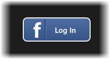
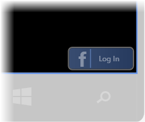
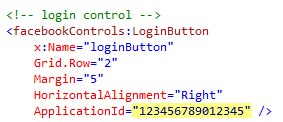
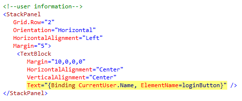
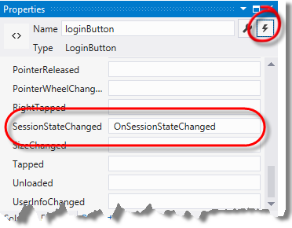
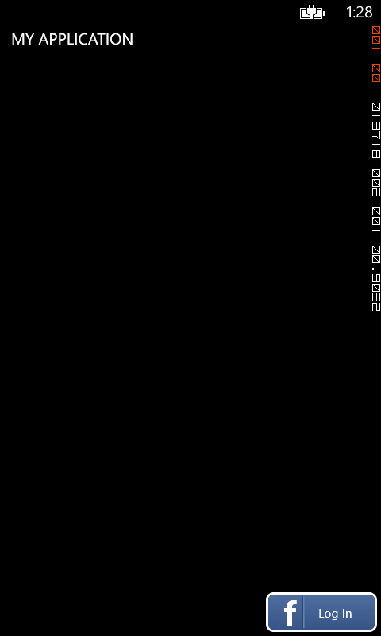
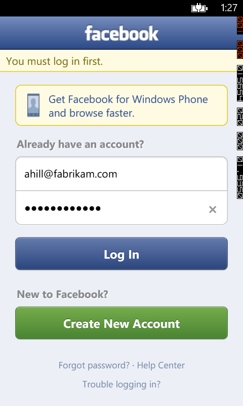
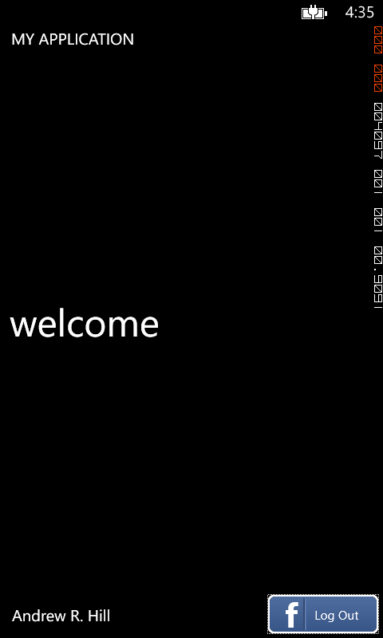

In this document:

* [Overview](#1)
* [Using the LoginButton Control](#2)
* [See Also](#3)

---

## Overview

The [LoginButton](/docs/reference/client/Client.Controls.LoginButton.html) control displays a user interface that allows users to log in or out of a Facebook session.

It keeps track of the authentication status presenting a caption that reflects whether the user is currently authenticated. When a user logs in, it can optionally retrieve basic information from their Facebook profile including first, middle, and last names, user name, birthday, location, and the user’s Facebook URL.

---

## Using the LoginButton Control

In this tutorial, you will create an application that you can later reuse as a starting point for completing other tutorials in this series. The application defines a standard layout that includes a [LoginButton](/docs/reference/client/Client.Controls.LoginButton.html) control. Using this control, users log in and obtain an access token which can then be used to retrieve information from Facebook using the controls in the Facebook Client Library.

Before you get started, you need to register a Facebook Application by visiting the Facebook developer portal and obtaining an application ID. For more information, see for example, [Register and Configure a Facebook Application](https://developers.facebook.com/docs/samples/meals-with-friends/register-facebook-application/).

1.	In Visual Studio, create a new project using the **Windows Phone App** project template. 

1. Select **Windows Phone OS 8.0** as the target operating system version.

1.	Add the Facebook Client Library to your new project. Open the Package Manager Console from **Tools | Library Package Manager | Package Manager Console**, and then type the following command to install the **Facebook.Client NuGet package**.
	
		Install-Package Facebook.Client -pre

		
	

1.	Open **MainPage.xaml** in your project and switch to its XAML view.

1.	Add the following namespace mapping to the root element of the page allowing you to reference the controls in the Facebook Client Library by using the namespace prefix “_facebookControls_:”.

		xmlns:facebookControls="clr-namespace:Facebook.Client.Controls;assembly=Facebook.Client"

	

1.	First, update the row definitions of the _LayoutRoot_ **Grid** element
to insert an additional row and set its height to _Auto_. The updated section is shown below.

        <!--LayoutRoot is the root grid where all page content is placed-->
        <Grid x:Name="LayoutRoot" Background="Transparent">
            <Grid.RowDefinitions>
                <RowDefinition Height="Auto"/>
                <RowDefinition Height="*"/>
                <RowDefinition Height="Auto"/>
             </Grid.RowDefinitions>
        </Grid>

	In this layout, the top row will be used for the title, the bottom row will contain a login button and display information about the logged in user, whereas the center row will be used for content and to place other controls in the library as you explore them.

1. Now, replace the template-generated title panel with the following XAML that maximizes the screen real estate remaining for the controls. Note that some UI design best practices will be ignored for this tutorial.

        <!--TitlePanel contains the name of the application and page title-->
		 <StackPanel Grid.Row="0" Margin="2">
            <TextBlock Text="MY APPLICATION" Style="{StaticResource PhoneTextNormalStyle}"/>
        </StackPanel>

1.	Next, locate the **Grid** element named _ContentPanel_, which will be used to display the main content of the page and set its **Visibility** property to _Collapsed_ so that it is initially hidden. It will be made visible only after the user has logged in.

        <!--ContentPanel - place additional content here-->
        <Grid x:Name="ContentPanel" Grid.Row="1" Margin="12,0,12,0" Visibility="Collapsed">

        </Grid>

1.	Add a panel to the bottom row that will, for the time being, be used to display the name of the user currently logged in. In another tutorial, you will learn how to display the user’s picture in this area using the [ProfilePicture](/docs/reference/client/Client.Controls.ProfilePicture.html) control. 
Use the following XAML markup that defines a **TextBlock** element nested inside a **StackPanel** container.

       <!--user information-->
       <StackPanel 
           Grid.Row="2" 
           Orientation="Horizontal" 
           HorizontalAlignment="Left" 
           Margin="5">
           <TextBlock 
               Margin="10,0,0,0"
               HorizontalAlignment="Center"
               VerticalAlignment="Center" />
        </StackPanel>

1.	Finally, insert a [LoginButton](/docs/reference/client/Client.Controls.LoginButton.html) control from the Facebook Client Library and assign it to the bottom row of the layout, as shown below.

        <!-- login control -->
        <facebookControls:LoginButton 
            x:Name="loginButton" 
            Grid.Row="2" 
            Margin="5"
            HorizontalAlignment="Right" />

1.	If you briefly switch to the Design view of the page, you will notice that the button appears to be disabled. This is because its **ApplicationId** property still needs to be configured.
 
	

1.	Set the **ApplicationId** property of the [LoginButton](/docs/reference/client/Client.Controls.LoginButton.html) to the ID obtained when you registered your application in the Facebook portal. 
 
	

	For example:
 
	

1.	Whenever a user clicks the [LoginButton](/docs/reference/client/Client.Controls.LoginButton.html) and proceeds to log in, the control retrieves profile information about the user and makes it available through its **CurrentUser** property, which returns an instance of a **GraphUser** object. Using this object, you can access information such as the user’s ID, their first, middle, and last name, birthday, location, and profile picture URL, among other values. Note that you can prevent the control from retrieving any information by setting its **FetchUserInfo** property to _false_.

	As mentioned previously, the bottom row in the page’s layout displays user information, in this case, their name. To set it up, locate the **TextBlock** that you previously inserted into the user information panel in the bottom row and bind its **Text** property to the **Name** of the **CurrentUser** property provided by the [LoginButton](/docs/reference/client/Client.Controls.LoginButton.html) control, as shown below.
 
	

1.	Now, insert code to make the content panel visible after the user logs in. To determine when the user has successfully opened the session, use the **SessionStateChanged** event of the [LoginButton](/docs/reference/client/Client.Controls.LoginButton.html) control.

	Add a handler for this event by selecting the button on the design surface, and then showing its Events view in the Properties window. Locate the **SessionStateChanged** event entry, type _OnSessionStateChanged_ as the name of the event handler, then press **ENTER** to create it and switch focus to the code-behind file.
	 
	

1.	The code-behind file should already contain an empty implementation for the **OnSessionStateChanged** event handler. Complete this implementation by adding the following code that makes the content panel visible when the session state changes to _Opened_.

		private void OnSessionStateChanged(object sender, Facebook.Client.Controls.SessionStateChangedEventArgs e)
		{
			this.ContentPanel.Visibility = (e.SessionState == Facebook.Client.Controls.FacebookSessionState.Opened) ?
										Visibility.Visible : Visibility.Collapsed;
		}

1.	In its current state, the application has no useful content that needs to be displayed. In its place, insert a **TextBlock** element with a welcome message into the content area to be shown once the user logs in.

        <!--ContentPanel - place additional content here-->
        <Grid x:Name="ContentPanel" Grid.Row="1" Margin="12,0,12,0" Visibility="Collapsed">
            <TextBlock FontSize="48" 
						HorizontalAlignment="Left" 
						VerticalAlignment="Center" 
						Text="welcome"/>
        </Grid>

1.	The page is ready and you can now test it, but before you do that, verify that you have completed the previous steps successfully by comparing your work with the following XAML markup.

        <phone:PhoneApplicationPage
            x:Class="FacebookControls_WP8.MainPage"
            xmlns="http://schemas.microsoft.com/winfx/2006/xaml/presentation"
            xmlns:x="http://schemas.microsoft.com/winfx/2006/xaml"
            xmlns:phone="clr-namespace:Microsoft.Phone.Controls;assembly=Microsoft.Phone"
            xmlns:shell="clr-namespace:Microsoft.Phone.Shell;assembly=Microsoft.Phone"
            xmlns:d="http://schemas.microsoft.com/expression/blend/2008"
            xmlns:mc="http://schemas.openxmlformats.org/markup-compatibility/2006"
            xmlns:facebookControls="clr-namespace:Facebook.Client.Controls;assembly=Facebook.Client"
            mc:Ignorable="d"
            FontFamily="{StaticResource PhoneFontFamilyNormal}"
            FontSize="{StaticResource PhoneFontSizeNormal}"
            Foreground="{StaticResource PhoneForegroundBrush}"
            SupportedOrientations="Portrait" Orientation="Portrait"
            shell:SystemTray.IsVisible="True">

            <!--LayoutRoot is the root grid where all page content is placed-->
            <Grid x:Name="LayoutRoot" Background="Transparent">
                <Grid.RowDefinitions>
                    <RowDefinition Height="Auto"/>
                    <RowDefinition Height="*"/>
                    <RowDefinition Height="Auto"/>
                </Grid.RowDefinitions>

                <!--TitlePanel contains the name of the application and page title-->
                <StackPanel Grid.Row="0" Margin="2">
                    <TextBlock Text="MY APPLICATION" Style="{StaticResource PhoneTextNormalStyle}"/>
                </StackPanel>

                <!--ContentPanel - place additional content here-->
                <Grid x:Name="ContentPanel" Grid.Row="1" Margin="12,0,12,0" Visibility="Collapsed">
                    <TextBlock FontSize="48" 
						        HorizontalAlignment="Left" 
						        VerticalAlignment="Center" 
						        Text="welcome"/>
                </Grid>

                <!--user information-->
                <StackPanel 
                   Grid.Row="2" 
                   Orientation="Horizontal" 
                   HorizontalAlignment="Left" 
                   Margin="5">
                    <TextBlock 
                       Margin="10,0,0,0"
                       HorizontalAlignment="Center"
                       VerticalAlignment="Center" 
                       Text="{Binding CurrentUser.Name, ElementName=loginButton}" />
                </StackPanel>
        
                <!-- login control -->
                <facebookControls:LoginButton 
                    x:Name="loginButton" 
                    Grid.Row="2" 
                    Margin="5"
                    HorizontalAlignment="Right" 
                    ApplicationId="123456789012345" SessionStateChanged="OnSessionStateChanged" />
            </Grid>

        </phone:PhoneApplicationPage>

1.	Build and run the application. Click **Log In** to start the Facebook authentication process. 
 
	

1.	Enter your Facebook credentials and click **Log In**.
 
	

1.	Once the log in dialog window closes, notice that the caption of the button changes to **Log Out** and your user name is displayed in the lower left corner of the page. Lastly, observe the welcome message in the page confirming that the **SessionStateChanged** event was raised to indicate that the session was opened successfully.
 
	

1.	Click **Log Out** to close the session. 
	Keep in mind that the Facebook access token is cached. If you stop the application in the debugger while the session is open, the next time you run the application and click **Log In**, if the cached token has not expired, you will be logged in without being prompted again for credentials. Clicking **Log Out** closes the session and clears the access token.

---

## See Also

