##Introduction

This multipart tutorial walks you through integrating Facebook into a C#/XAML based Windows Phone app. You'll create a timeline app that lets people post about meals they ate.

This sample app is based on the Scrumptious sample app provided by Facebook for other mobile platforms.  The completed sample is present at [https://github.com/facebook-csharp-sdk/facebook-windows-phone-sample.git](https://github.com/facebook-csharp-sdk/facebook-windows-phone-sample.git "https://github.com/facebook-csharp-sdk/facebook-windows-phone-sample.git") Once you clone the repository, open the project Facebook.Scrumptious.Windows-Phone.sln This is how the completed sample should look like. 

Facebook Login page

Scrumptious Landing Page

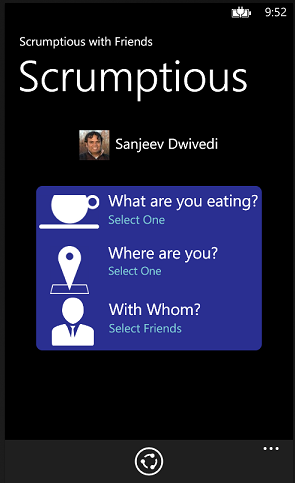

Posted event on your timeline

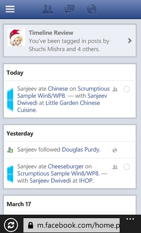

To complete the tutorial, you'll need some familiarity with Windows Phone development. In particular, you will need familiarity with Visual Studio 2012 and being able to create and debug Windows Phone projects in C# and XAML. Familiarity with Expression Blend for Visual Studio will be of additional benefit.

### Setting up your Facebook Application
Before you can get started with the Windows Phone Application, you have to create a _Facebook Application_ and obtain a Facebook AppId on the Facebook developer portal. To do this, first you need to go to [Facebook Developer Portal](http://developers.facebook.com/apps) and create a Facebook App.

Once you have created the app, you need to edit the app and change a few settings. Make sure to set the _DisplayName_ and _namespace_ appropriately. Also, make sure to set the _email address_. One of the crucial things is the _App Domain_ box. In this box, you should add a domain without the _http://_ prefix. Make sure you have control of the website because later in this tutorial, you will need to place some static pages there. As of yet, Facebook does not have a dedicated section for Windows Phone, so for now, select the section "Website with Facebook Login". in the _Site URL_ field, put the website that you earlier picked for the App Domain, except make sure that you prefix it with an "https://" this time. Don't worry,  you will not have to configure your website with a real SSL functionality. This is just to make the _Website with Facebook Login_ dialog happy.

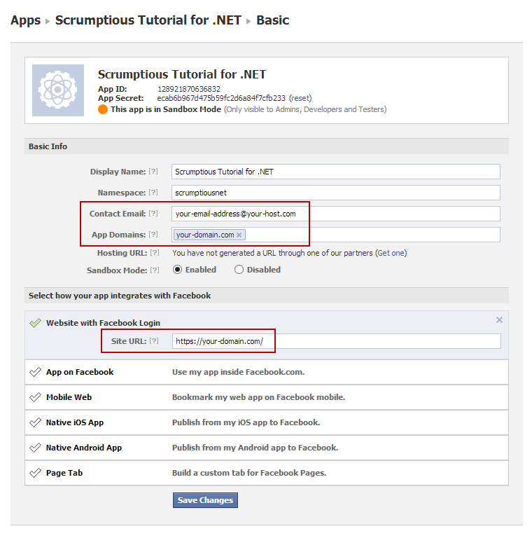

> **Important**: You may have to wait 5-10 minutes for the App you just created to propagate through the Facebook system before it becomes Active. If your app's facebook login is not working immediately after you created the App, give it 10 minutes and try again.

### Getting Started on the Application
To get started, create a Visual Studio project using the _Visual C# -> Windows Phone -> Windows Phone App_. Let us call our app the _Facebook.Scrumptious.WindowsPhone_. Visual Studio will ask if you want to target _Windows Phone OS 7.1 or 8.0_. You can choose either, the code for the Facebook integration works with both versions the same way. In this tutorial however, we will assume that the selected version is 8.0. For the sake of this tutorial, you should select 8.0 to avoid any surprises. This will create a barebones application with a single blank page.

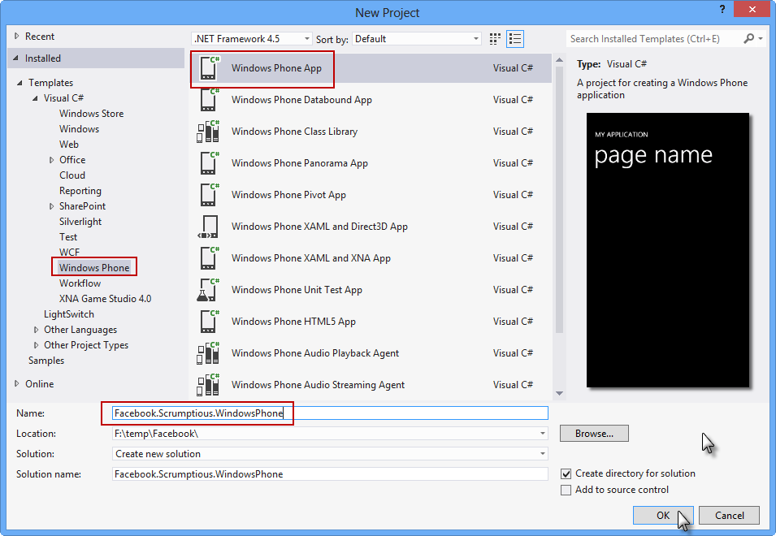

Install the Facebook nuget package into the solution by starting the Package Manager powershell by following:

_Tools->Library Package Manager->Package Manager console_

Once the powershell command prompt is running, type the following two commands

    Install-Package Facebook

    Install-Package Facebook.Client -pre

These will download the nuget packages and install the SDK into your project and add it to the references.

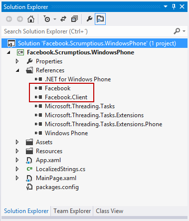

> **Note**: The _-pre_ flag is applied to the Facebook.Client NuGet package because it is still in preview mode owing to currently being in active development. Once this package is stable, you will not need the _-pre_ flag.

Once you've done that, work through the following steps of the tutorial:

*    Authenticate: Implement Facebook Login and ask the user for the permissions your app needs.
*    Personalize: Personalize the user's experience with their profile picture and name when they log in.
*    Show Friends: Display the user's friend list and let them select one or more friends.
*    Show Nearby Places: Display a list of nearby places and let the user tag their location.
*    Publish an Open Graph Action: Publish activity from your app to timeline and news feed, and set up the back-end server for Open Graph objects.

By the end of this tutorial, you should have a working understanding of how to log a user into to Facebook, personalize their experience and make an app social. Let's start the tutorial.

##Authenticate

###Setup the project and User Interface

Create two folders called ViewModel and Pages in the project. This is how it will look like:

Add login button to MainPage

Facebook Authentication on Windows Phone works using OAuth. The Facebook.Client library comes built in with the _FacebookSessionClient_ construct which automatically displays a WebBrowser for the Facebook login. However, whenever we make a login call from within a page, we will first see the UI in the page which made the login call and then we will navigate to the Login page and then back to the original page. If the original page has any UI, the flow will not be smooth as the user will see the UI and then suddently be transitioned to a login page and then transitioned back to the original UI. To avoid this, we will invoke the login page from a blank page and when the login has succeeded, we will navigate to the page where we will host the final Scrumptious UI. Thus, we will start by adding a login button to the MainPage.xaml. On clicking the Login button, we will navigate to another Page called _FacebookLoginPage_ which will be the blank page that will show the OAuth login page. To do this, replace the contents of MainPage.xaml with the following:

    <phone:PhoneApplicationPage 
        x:Class="Facebook.Scrumptious.WindowsPhone.MainPage"
        xmlns="http://schemas.microsoft.com/winfx/2006/xaml/presentation"
        xmlns:x="http://schemas.microsoft.com/winfx/2006/xaml"
        xmlns:phone="clr-namespace:Microsoft.Phone.Controls;assembly=Microsoft.Phone"
        xmlns:shell="clr-namespace:Microsoft.Phone.Shell;assembly=Microsoft.Phone"
        xmlns:d="http://schemas.microsoft.com/expression/blend/2008"
        xmlns:mc="http://schemas.openxmlformats.org/markup-compatibility/2006"
        mc:Ignorable="d" d:DesignWidth="480" d:DesignHeight="768"
        FontFamily="{StaticResource PhoneFontFamilyNormal}"
        FontSize="{StaticResource PhoneFontSizeNormal}"
        Foreground="{StaticResource PhoneForegroundBrush}"
        SupportedOrientations="Portrait" Orientation="Portrait"
        shell:SystemTray.IsVisible="True">
    
        <!--LayoutRoot is the root grid where all page content is placed-->
        <Grid x:Name="LayoutRoot" Background="Transparent">
            <Grid.RowDefinitions>
                <RowDefinition Height="Auto"/>
                <RowDefinition Height="*"/>
            </Grid.RowDefinitions>
    
            <!--TitlePanel contains the name of the application and page title-->
            <StackPanel x:Name="TitlePanel" Grid.Row="0" Margin="12,17,0,28">
                <TextBlock x:Name="ApplicationTitle" Text="FACEBOOK C# SDK" Style="{StaticResource PhoneTextNormalStyle}"/>
                <TextBlock x:Name="PageTitle" Text="login" Margin="9,-7,0,0" Style="{StaticResource PhoneTextTitle1Style}"/>
            </StackPanel>
    
            <!--ContentPanel - place additional content here-->
            <Grid x:Name="ContentPanel" Grid.Row="1" Margin="12,0,12,0">
                <Button Content="Login To Facebook" Height="73" HorizontalAlignment="Left" Margin="101,252,0,0" Name="btnFacebookLogin" VerticalAlignment="Top" Width="276" Click="btnFacebookLogin_Click" />
            </Grid>
        </Grid>
     
    </phone:PhoneApplicationPage>

We will keep the rest of our Pages in the _Pages_ Folder. The first page we want to add is the page that will host the WebBrowser control for OAuth. To do so, right click on the _Pages_ folder and select _Add New Item_. Select Visual C# on the left in the Add Dialog and then select _Windows Phone Portrait Page_ in the middle pane and name it FacebookLoginPage.xaml.

At this point, we will additionally add another page that we want to navigate to once the authentication has succeeded. To do so, just like before add another page to the _Pages_ folder using "Add new Item". Name this page _LandingPage.xaml_. In future references, I will assume you know how to add new Pages to the Pages folder.

To create the blank FacebookLoginPage, replace the contents of FacebookLoginPage.xaml with the following:

    <phone:PhoneApplicationPage 
        x:Class="Facebook.Scrumptious.WindowsPhone.Pages.FacebookLoginPage"
        xmlns="http://schemas.microsoft.com/winfx/2006/xaml/presentation"
        xmlns:x="http://schemas.microsoft.com/winfx/2006/xaml"
        xmlns:phone="clr-namespace:Microsoft.Phone.Controls;assembly=Microsoft.Phone"
        xmlns:shell="clr-namespace:Microsoft.Phone.Shell;assembly=Microsoft.Phone"
        xmlns:d="http://schemas.microsoft.com/expression/blend/2008"
        xmlns:mc="http://schemas.openxmlformats.org/markup-compatibility/2006"
        FontFamily="{StaticResource PhoneFontFamilyNormal}"
        FontSize="{StaticResource PhoneFontSizeNormal}"
        Foreground="{StaticResource PhoneForegroundBrush}"
        SupportedOrientations="Portrait" Orientation="Portrait"
        mc:Ignorable="d" d:DesignHeight="768" d:DesignWidth="480"
        shell:SystemTray.IsVisible="True">

        <!--LayoutRoot is the root grid where all page content is placed-->
        <Grid x:Name="LayoutRoot" Background="Transparent">
            <Grid.RowDefinitions>
                <RowDefinition Height="Auto"/>
                <RowDefinition Height="*"/>
            </Grid.RowDefinitions>

            <!--ContentPanel - place additional content here-->
            <Grid x:Name="ContentPanel" Grid.Row="1" Margin="12,0,12,0">
                
            </Grid>
        </Grid>

        <!--Sample code showing usage of ApplicationBar-->
        <!--<phone:PhoneApplicationPage.ApplicationBar>
            <shell:ApplicationBar IsVisible="True" IsMenuEnabled="True">
                <shell:ApplicationBarIconButton IconUri="/Images/appbar_button1.png" Text="Button 1"/>
                <shell:ApplicationBarIconButton IconUri="/Images/appbar_button2.png" Text="Button 2"/>
                <shell:ApplicationBar.MenuItems>
                    <shell:ApplicationBarMenuItem Text="MenuItem 1"/>
                    <shell:ApplicationBarMenuItem Text="MenuItem 2"/>
                </shell:ApplicationBar.MenuItems>
            </shell:ApplicationBar>
        </phone:PhoneApplicationPage.ApplicationBar>-->

    </phone:PhoneApplicationPage>

At this step, also add a new item of type _class_ to the _ViewModel_ folder. Call the class _Constants.cs_ and add the following code to it. Make sure to replace the string _Your Facebook App ID here_ with your Facebook App ID that you obtained earlier when you created your app on the Facebook Developer Portal.

    class Constants
    {
        public static readonly string FacebookAppId = "Your Facebook App ID here";
    }

In App.xaml.cs add the following four variables to hold the Facebook OAuth Access Token, the User's ID once they have logged in into Facebook, a flag to keep track that the user has already been authenticated and the FacebookSessionClient class which wraps the Facebook OAuth login in a convenient fashion:

    internal static string AccessToken = String.Empty;
    internal static string FacebookId = String.Empty;
    public static bool isAuthenticated = false;
    public static FacebookSessionClient FacebookSessionClient = new FacebookSessionClient(Constants.FacebookAppId);

This will show a red line under the _Constants_ declaration, showing Visual Studio does not know where Constants class is located. This can easily be resolved by right clicking on _Constants_ and selecting 'Resolve". 

You can also resolve this by manually typing at the top of the page the following line:

    using Facebook.Scrumptious.WindowsPhone.ViewModel;

Do the same with the _FacebookSessionClient_ reference. In future references, I will assume that you know how to resolve a reference.

Let's now wire up the event handlers in _MainPage_ to navigate to _FacebookLogin_ page to authenticate to Facebook via OAuth when the user clicks the Facebook Login button. To do this, copy the following code to _MainPage.xaml.cs_.

    private void btnFacebookLogin_Click(object sender, RoutedEventArgs e)
    {
        NavigationService.Navigate(new Uri("/Pages/FacebookLoginPage.xaml", UriKind.Relative));
    }

Once the user has navigated, to the OAuth page, we want to connect the event handlers so that the FacebookLogin will load the OAuth dialog using FacebookSessionClient and navigate to LandingPage when the login succeeds. To do this, copy the following code snippets into _FacebookLoginPage.xaml.cs_. First add the following line to the FacebookLoginPage constructor, which invokes the Facebook login as soon as we navigate to the FacebookLoginPage:

    this.Loaded += FacebookLoginPage_Loaded;

Then add the following code snippet to the LandingPage.xamls.cs, which checks if the user is already authenticated and if not, invokes the Authentication.

    async void FacebookLoginPage_Loaded(object sender, RoutedEventArgs e)
    {
        if (!App.isAuthenticated)
        {
            App.isAuthenticated = true;
            await Authenticate();
        }
    }

As the final step of Autentication add the following code to perform the Authentication and request read permissions for the user's profile and other data, and to navigate to the LandingPage when the login has succeeded.

    private FacebookSession session;
    private async Task Authenticate()
    {
        string message = String.Empty;
        try
        {
            session = await App.FacebookSessionClient.LoginAsync("user_about_me,read_stream");
            App.AccessToken = session.AccessToken;
            App.FacebookId = session.FacebookId;

            Dispatcher.BeginInvoke(() => NavigationService.Navigate(new Uri("/Pages/LandingPage.xaml", UriKind.Relative)));
        }
        catch (InvalidOperationException e)
        {
            message = "Login failed! Exception details: " + e.Message;
            MessageBox.Show(message);
        }
    }

Make sure to resolve any missing dependencies as illustrated above to ensure that the code builds without errors. 

You should now be able to run the app and login to Facebook. When executed, your app should present you with the following dialogs. When you are successfully logged in, you should be navigated to a blank page - LandingPage.

Login Page

Basic Permissions Page

## Personalize

This section outlines how to personalize your app experience with the Facebook SDK for Windows Phone by displaying the user's profile picture and name.

### Setup the UI

Insert the following code to the LandingPage.xaml file, which merely adds an image control and a TextBlock to hold the User's profile picture and name. Make sure to replace the body of the Grid named _ContentPanel_ with the following code:

    <Grid x:Name="ContentPanel" Grid.Row="1" Margin="12,0,12,0">
        <Grid.RowDefinitions>

        </Grid.RowDefinitions>
        <Grid Margin="0,0,0,149">
            <Grid.RowDefinitions>
                <RowDefinition Height="92"/>
                <RowDefinition Height="*"/>

            </Grid.RowDefinitions>
            <StackPanel Orientation="Horizontal" Grid.Row="0" VerticalAlignment="Center" HorizontalAlignment="Center">
                <Image x:Name="MyImage" HorizontalAlignment="Left" Height="50" VerticalAlignment="Top" Width="50"/>
                <TextBlock x:Name="MyName" HorizontalAlignment="Center" TextWrapping="Wrap" FontSize="24" Height="50" Text="Your Name Here" Foreground="{StaticResource PhoneForegroundBrush}" VerticalAlignment="Center" Margin="10,5,0,0"/>

            </StackPanel>
        </Grid>
    </Grid>

Also, give a correct name to the page by changing the smaller font text on the page from _My Application_ to _Scrumptious with Friends_  and the bigger font text to be _Scrumptious_ in the XAML file.

### Retrieve the User's profile data and display it

At this point, the user has been Authenticated and their AccessToken and FacebookId is stored in App.xaml.cs static variables and hence it is available throughout the program. Now copy the following code into LandingPage.xaml.cs:

    private void LoadUserInfo()
    {
        var fb = new FacebookClient(App.AccessToken);

        fb.GetCompleted += (o, e) =>
        {
            if (e.Error != null)
            {
                Dispatcher.BeginInvoke(() => MessageBox.Show(e.Error.Message));
                return;
            }

            var result = (IDictionary<string, object>)e.GetResultData();

            Dispatcher.BeginInvoke(() =>
                {
                    var profilePictureUrl = string.Format("https://graph.facebook.com/{0}/picture?type={1}&access_token={2}", App.FacebookId, "square", App.AccessToken);

                    this.MyImage.Source = new BitmapImage(new Uri(profilePictureUrl));
                    this.MyName.Text = String.Format("{0} {1}", (string)result["first_name"], (string)result["last_name"]);
                });
        };

        fb.GetTaskAsync("me");
    }

The above code retrieves the user profile data. It additionally creates a URL for the user's profile picture and sets it as the source of the image. This causes the image to automatically retrieve the profile picture and load it correctly.

As a final step in personalization, we have to invoke the function as soon as the page has been loaded. To do this, add the following line in the Constructor after the InitializeComponent call:

    LoadUserInfo();

As before, make sure to resolve any missing dependencies as illustrated earlier to ensure that the code builds and runs without errors. At the end of this step, your UI for landing page will look like the following:

##Show Friends

### Creating the UI

[Download the icons file ](Assets/icons.zip) to get the icons for the tutorial. Uncompress the file, create a folder named Images in the project and drag all the icons to the Images folder in Visual Studio project window.

After that, add the following code to the _LandingPage.xaml_ file below the StackPanel element. This adds an icon and Text for _Selecting Friends_. Additionally, it wires up the tap event on the _Select Friends_ TextBlock via an event handler named friendSelectorTextBlockHandler.

    <Border Grid.Row="1" HorizontalAlignment="Center" CornerRadius="10" Background="#FF2A2F91" Margin="0,20,0,0">
        <Grid Margin="5">
            <Grid.RowDefinitions>
                <RowDefinition Height="97*"/>
                <RowDefinition Height="105*"/>
                <RowDefinition Height="92*"/>
            </Grid.RowDefinitions>
            <Grid x:Name="WithWhomGrid" Grid.Row="2" >
                <Grid.ColumnDefinitions>
                    <ColumnDefinition Width="99*"/>
                    <ColumnDefinition Width="361*"/>
                </Grid.ColumnDefinitions>
                <Image HorizontalAlignment="Right" Height="80" Margin="0,0,10,0" VerticalAlignment="Top" Width="100" Stretch="None" Source="/Images/Person.png" Grid.Column="0       "/>
                <StackPanel Grid.Column="1" Margin="15,0,0,0">
                    <TextBlock HorizontalAlignment="Left" TextWrapping="Wrap" Text="With Whom?" VerticalAlignment="Top" FontSize="26.667"/>
                    <TextBlock x:Name="WithWhoTextBox" HorizontalAlignment="Left" TextWrapping="Wrap" Text="Select Friends" VerticalAlignment="Top" Tap="friendSelectorTextBlockHandler" Foreground="#FF7CC8D4"/>
                </StackPanel>
            </Grid>
        </Grid>
    </Border>

We will now make the app a bit more interactive and let the user pick out their friends.

### Create the ViewModel class

Create an static ObservableCollection of friends that you will later use to connect the UI to the data. Making it ObservableCollection allows you to use one of the strongest points of XAML, data binding.

In the ViewModel folder, create a new item of type Class and set its name to be _FacebookDataModel.cs_ Inside this file, remove the class FacebookDataModel and paste the following code which defines a class representing a _Facebook Friend_. We are also declaring an _ObservableCollection of Friend_ inside another class called _FacebookData_ which will represent the list of our friends. Declaring this as an _ObservableCollection_ has the added advantage that we can use Expression Blend to easily bind the collection data to the UI without having to write complicated DataModel<->UI synchronization logic.  After adding the following code, resolve the missing dependencies.

    public class Friend
    {
        public string id { get; set; }

        public string Name { get; set; }

        public Uri PictureUri { get; set; }
    }

    public class FacebookData
    {
        private static ObservableCollection<Friend> friends = new ObservableCollection<Friend>();
        
        public static ObservableCollection<Friend> Friends
        {
            get
            {
                return friends;
            }
        }
    }

### Create the Friend Picker Page
To the Pages directory, add a Basic Page called FriendSelector.xaml. This page will hold the UI for showing and picking friends.

Now, create the handler for the tapping event on the _Select Friends_ text box. Paste the following code in the LandingPage.xaml.cs file and resolve the missing dependencies. This code brings down the list of friends from Facebook.

    private void friendSelectorTextBlockHandler(object sender, System.Windows.Input.GestureEventArgs evtArgs)
    {
        FacebookClient fb = new FacebookClient(App.AccessToken);

        fb.GetCompleted += (o, e) =>
        {
            if (e.Error != null)
            {
                Dispatcher.BeginInvoke(() => MessageBox.Show(e.Error.Message));
                return;
            }

            var result = (IDictionary<string, object>)e.GetResultData();

            var data = (IEnumerable<object>)result["data"]; ;

            Dispatcher.BeginInvoke(() =>
            {
                // The observable collection can only be updated from within the UI thread. See 
                // http://10rem.net/blog/2012/01/10/threading-considerations-for-binding-and-change-notification-in-silverlight-5
                // If you try to update the bound data structure from a different thread, you are going to get a cross
                // thread exception.
                foreach (var item in data)
                {
                    var friend = (IDictionary<string, object>)item;

                    FacebookData.Friends.Add(new Friend { Name = (string)friend["name"], id = (string)friend["id"], PictureUri = new Uri(string.Format("https://graph.facebook.com/{0}/picture?type={1}&access_token={2}", (string)friend["id"], "square", App.AccessToken)) });
                }

                NavigationService.Navigate(new Uri("/Pages/FriendSelector.xaml", UriKind.Relative));
            });

        };

        fb.GetTaskAsync("/me/friends");
    }

Let's take a deeper look at the code to fetch the list of Friends. You should notice that we setup the _FacebooClient_ class with the AccessToken, setup a _GetCompleted_ handler on it and then finally, perform a _fb.GetTaskAsync()_ call on it. What we are doing here is that we are setting up the event handler for the asynchronous friend list retrieval operation operation first and then firing the retrieval request. 

> **Note**: One important point to keep in mind is the _Dispatcher.BeginInvoke_ lambda expression. In the next few steps, we will attach the retrieved data to the UI using Data Binding. Data Binding allows UI to be updated automatically whenver the underlying data changes. However, this also means that if any thread other than the UI thread changes the underlying data, the UI cannot handle the update operation and your application will crash with a _cross thread access exception_. Thus, anytime you wish to update the UI from a different thread, you should get a handle to the UI Dispatcher and update the UI within that thread.

To understand friends data that we just retrieved, we have to understand it's schema. The [Graph Explorer on facebook](https://developers.facebook.com/tools/explorer/) is an invaluable tool for this purpose. Navigate to the above Graph Explorer website, login and fetch the URL _/me/friends_ to see how facebook sends the data back in JSON format:

> **Note**: You need to obtain the access token by clicking on the _Get Access Token_ button. It is not necessary to select any permission for now.

The data returned is similar to the following:

    {
        "data": [
                    {
                        "name": "Ashu Razdan", 
                        "id": "2516036"
                    }, 
                    {
                        "name": "Jessie Rymph", 
                        "id": "3103754"
                    }
                ]
    }
    
You can navigate data similar to above using _dictionaries_ pretty simply as shown below without the need to write complicated deserialization code. The following typecasts the result returned into a dictionary of _<string,object>_. From that, we retrieve the value corresponding to the key _data_ in the dictionary.

    var result = (IDictionary<string, object>)e.GetResultData();
    var data = (IEnumerable<object>)result["data"];

Following similar logic, we can retrieve each of our friends as a single object in the _foreach_ statement. Once we have obtained each object, we typecast it again to another dictionary and pick up the individual properties as shown below. This style of parsing data allows you to pick data from JSON objects without needing to create DeSerializer classes. We now, create _Friend_ objects and add them to the _static ObservableCollection_ named _Friends_ in the _FacebookData_ class. We will shortly use this Collection to create our Friend Selector page.

    foreach (var item in data)
    {
        var friend = (IDictionary<string, object>)item;

        FacebookData.Friends.Add(new Friend { Name = (string)friend["name"], id = (string)friend["id"], PictureUri = new Uri(string.Format("https://graph.facebook.com/{0}/picture?type={1}&access_token={2}", (string)friend["id"], "square", App.AccessToken)) });
    }

### Create the Friend Picker

Now that we have the Friends list as an ObservableCollection, we can create and bind it to the  UI using code, but it is much easier doing that using Expression Blend, so let's instead do that. To use Expression Blend on the project, right click on the project in Visual Studio and select _Open in Blend_. 

> **Note**: Expression blend is one of the tools that makes developing UI in XAML extremely easy. Additionally, binding list data to UI becomes extremely easy with Blend. It is worth learning Expression Blend if you plan to do any long term development in C#/XAML. A good resource for learning Expression Blend is [Pro Expression Blend](http://www.amazon.com/Pro-Expression-Blend-Andrew-Troelsen/dp/143023377X/ref=sr_1_1?ie=UTF8&qid=1363585145&sr=8-1&keywords=expression+blend).

#### Set up a LongListSelector/ListBox to hold the List of Friends
Go to Projects tab and double click the FriendSelector in Expression Blend. The FriendSelector page will open in the main pane.

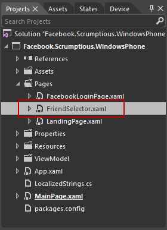

Click on the Assets tab and search for _LongListSelector_ (or _ListBox_ in Windows Phone 7). Taking care to make sure that the ContentPanel element, which houses the entire page is selected in the _Objects and Timeline_ window, double click the _LongListSelector_.

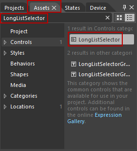

This will add the LongListSelector/ListBox as the direct child of the _LayoutRoot_ below the _ContentPanel_.

The above step will add the LongListSelector/ListBox in the top left corner of the content panel with a square size which is not what we want.

Select the LongListSelector/ListBox by clicking on it and drag and drop it under the _ContentPanel_ element. Then, in the _Properties_ panel on the right side. What we really want is for the LongListSelector/ListBox to occupy the entire width of screen but only as much vertical space is required. This can easily be done by setting its Height and With property to Auto by clicking on the icons on the right side of Height and Width in the properties panel. Additionally, set the HorizontalAlignment and VerticalAlignment to scale. See the image below for illustration.

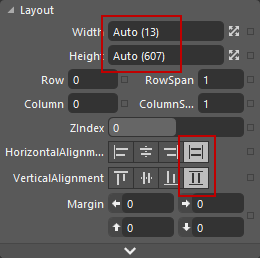

#### Setup the Data Binding of the LongListSelector/ListBox

Click on the tab in the right top corner named _Data_. In there, click on the icon that looks like a DB connected to a pipe (see illustration below) and select _Create Object Data Source_. 

This will pop up a Window titled _Create Object Data Source_. Expand the _Facebook.Scrumptious.Windows8.ViewModel_ and select the _FacebookData_ node. This makes the entire _FacebookData_ class available to this page as a resource. Any UI element can now bind to variables in the _DataContext_.

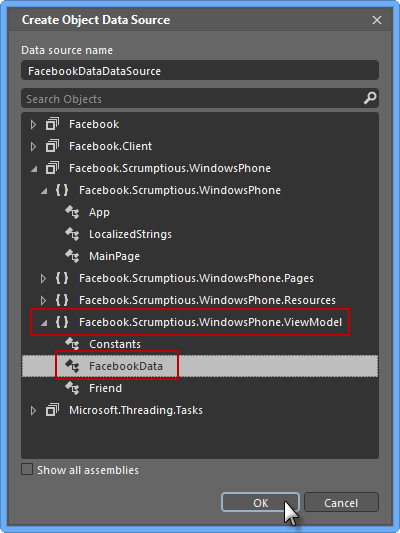

Now, we will bind the LongListSelector/ListBox to the _ObservableCollection_ of _Friends_ in the _FacebookData_ class that is available to us via the _DataContext_ we just created above. First make sure to reselect the _Properties_ tab instead of the _Data_ tab that is selected in the panel at the top right corner. Now, to create the data binding, select the LongListSelector/listbox in the _Objects and Timeline_ window and click on the little square next to the _ItemsSource_ property. This will pop up a Context Menu, select _Create Data Binding_ from it. This will open a window called "Create Data Binding for [LongListSelector].ItemsSource. Select the _Friends_ collection from this window and hit OK. This will set the Friends ObservableCollection to the Source of Data for this LongListSelector/ListBox.

Click on square next to Items Source

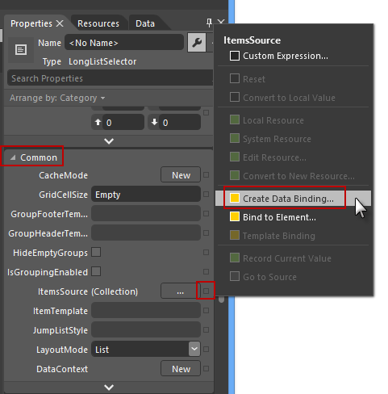

Bind to _ObservableCollection<Friends>_

At this point, the LongListSelector/ListBox is bound to the ObservableCollection, but individual properties in the Friend Objects are not bound to individual list items in the LongListSelector/ListBox. To do this, right click on the LongListSelector/ListBox in the _Objects and Timeline_ window, select _Edit Additional Templates -> Edit ItemTemplate -> Create Empty_ and hit OK on resulting dialog box.

This will create the layout of a single list item. For each Friend, we are going to retrieve an Image and name, so lets search for Image and TextBlock items in the Assets Window and add them here under the _Grid_ element.

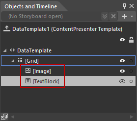

Similar to how you bound the ItemsSource of the LongListSelector/ListBox, you can now bind the Source for the Image and the Text for the TextBlock using Blend as well. See the illustrations below.

Bind the image source to the Friend object's PictureUri property.

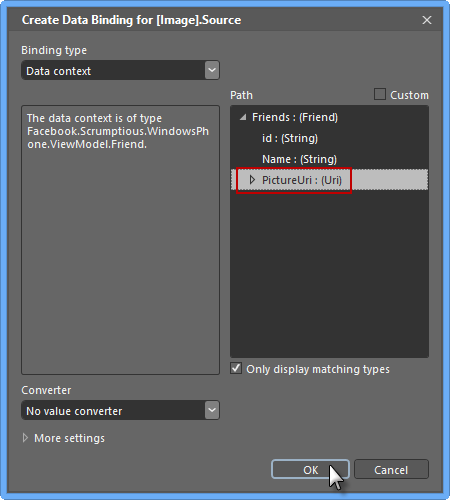

Bind the TextBlock's Text to the Friend object's Name property.

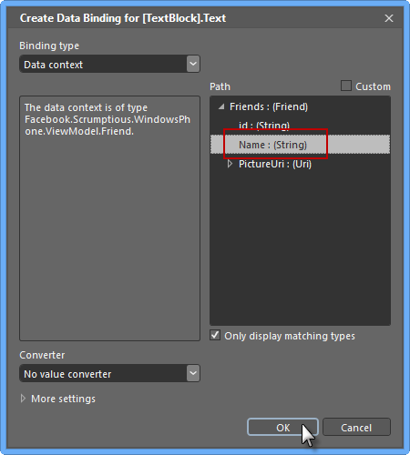

Also, set the Grid's height and width to Auto and the Image's Height and Width property to 50px each.

Save your work and run the program. If you have followed through all the steps, you will see the following screen:

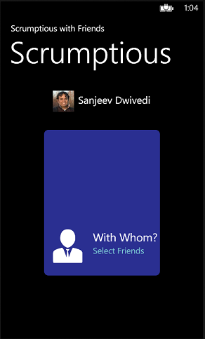

If you click on the _Select Friends_ text, it will take you to a list of friends, that looks like the following:

As you can see, using Blend, within a few easy steps, we are able to create a LongListSelector/ListBox and bind the friend data to it without writing a single line of code. The UI looks a bit garbled and we can pick only one friend at a time, but this illustrates the power of using Expression Blend. I will leave it as an exercise to you on how to follow along Blend and style the LongListSelector/ListBox and how to allow Multiple Select. In interest of making progress, at this point of time, just overwrite all the contents of the FriendSelector.xaml with the following pre-built and styled ListBox code:

    <phone:PhoneApplicationPage
    xmlns="http://schemas.microsoft.com/winfx/2006/xaml/presentation"
    xmlns:x="http://schemas.microsoft.com/winfx/2006/xaml"
    xmlns:phone="clr-namespace:Microsoft.Phone.Controls;assembly=Microsoft.Phone"
    xmlns:shell="clr-namespace:Microsoft.Phone.Shell;assembly=Microsoft.Phone"
    xmlns:d="http://schemas.microsoft.com/expression/blend/2008"
    xmlns:mc="http://schemas.openxmlformats.org/markup-compatibility/2006"
    xmlns:ViewModel="clr-namespace:Facebook.Scrumptious.WindowsPhone.ViewModel"
    x:Class="Facebook.Scrumptious.WindowsPhone.Pages.FriendSelector"
    SupportedOrientations="Portrait" Orientation="Portrait"
    mc:Ignorable="d"
    shell:SystemTray.IsVisible="True">

    <phone:PhoneApplicationPage.Resources>
        <ViewModel:FacebookData x:Key="FacebookDataDataSource" d:IsDataSource="True"/>
        <DataTemplate x:Key="FriendTemplate">
            <Grid Height="50" Margin="0,0,0,1" Width="456">
                <Grid.ColumnDefinitions>
                    <ColumnDefinition Width="50*"/>
                    <ColumnDefinition Width="360*"/>
                </Grid.ColumnDefinitions>
                <Image HorizontalAlignment="Left" Height="50" VerticalAlignment="Top" Width="50" Source="{Binding PictureUri}" Grid.Column="0"/>
                <TextBlock HorizontalAlignment="Left" TextWrapping="Wrap" Text="{Binding Name}" VerticalAlignment="Top" Grid.Column="1" FontSize="24"/>
            </Grid>
        </DataTemplate>
        
    </phone:PhoneApplicationPage.Resources>
    <phone:PhoneApplicationPage.FontFamily>
        <StaticResource ResourceKey="PhoneFontFamilyNormal"/>
    </phone:PhoneApplicationPage.FontFamily>
    <phone:PhoneApplicationPage.FontSize>
        <StaticResource ResourceKey="PhoneFontSizeNormal"/>
    </phone:PhoneApplicationPage.FontSize>
    <phone:PhoneApplicationPage.Foreground>
        <StaticResource ResourceKey="PhoneForegroundBrush"/>
    </phone:PhoneApplicationPage.Foreground>

    <!--LayoutRoot is the root grid where all page content is placed-->
    <Grid x:Name="LayoutRoot" Background="Transparent" DataContext="{Binding Source={StaticResource FacebookDataDataSource}}">
        <Grid.RowDefinitions>
            <RowDefinition Height="Auto"/>
            <RowDefinition Height="*"/>
        </Grid.RowDefinitions>

        <!--TitlePanel contains the name of the application and page title-->
        <StackPanel Grid.Row="0" Margin="12,17,0,28">
            <TextBlock Text="Select Friends" Margin="9,-7,0,0" Style="{StaticResource PhoneTextTitle1Style}"/>
        </StackPanel>

        <!--ContentPanel - place additional content here-->
        <Grid x:Name="ContentPanel" Grid.Row="1" Margin="12,0,12,0">
            <ListBox x:Name="friendList" DataContext="{Binding}" ItemsSource="{Binding Friends}" ItemTemplate="{StaticResource FriendTemplate}" SelectionMode="Multiple" ItemContainerStyle="{StaticResource FriendListBoxItemStyle}"/>

        </Grid>
    </Grid>
    </phone:PhoneApplicationPage>

Running the app after this will lead to a ListBox that looks like the following and also allows MultiSelect.

Now, add the following code to the _FacebookData_ class in _FacebooDataModel.cs_ to store the list of selected friends in the FriendSelector page.

    private static ObservableCollection<Friend> selectedFriends = new ObservableCollection<Friend>();
    
    public static ObservableCollection<Friend> SelectedFriends
    {
        get
        {
            return selectedFriends;
        }
    }

Add the following code to FriendSelector.xaml.cs to allow the selected list of friends to be stored in the _FacebookData.SelectedFriends_ variable, when we navigate away from the FriendSelector page. Resolve the missing dependencies.

    protected override void OnNavigatedFrom(NavigationEventArgs e)
    {
        // this runs in the UI thread, so it is ok to modify the 
        // viewmodel directly here
        FacebookData.SelectedFriends.Clear();
        var selectedFriends = this.friendList.SelectedItems;
        foreach (Friend oneFriend in selectedFriends)
        {
            FacebookData.SelectedFriends.Add(oneFriend);
        }

        base.OnNavigatedFrom(e);
    }

And finally, in LandingPage.xaml.cs, add the following code to update the LandingPage with the friends who have been selected:

    protected override void OnNavigatedTo(NavigationEventArgs e)
    {
        base.OnNavigatedTo(e);
        if (FacebookData.SelectedFriends.Count > 0)
        {
            if (FacebookData.SelectedFriends.Count > 1)
            {
                this.WithWhoTextBox.Text = String.Format("with {0} and {1} others", FacebookData.SelectedFriends[0].Name, FacebookData.SelectedFriends.Count - 1);
            }
            else
            {
                this.WithWhoTextBox.Text = "with " + FacebookData.SelectedFriends[0].Name;
            }
        }
        else
        {
            this.WithWhoTextBox.Text = "Select Friends";
        }
    }

Build the code at this point of time and make sure you resolve all symbols as shown earlier in the tutorial. This time around when you select friends on the FriendSelector Page and navigate back to the LandingPage, you should see the list of selected friends on the LandingPage.

##Show Nearby Places

Next, we will see how to query Facebook for Nearby places to eat.

### Setup the DataModel classes
Add the following code to FacebookDataModel.cs as a class in the namespace directly to hold the details of a single restaurant:

    public class Location
    {
        public string Street { get; set; }
        
        public string City { get; set; }
        
        public string State { get; set; }
        
        public string Country { get; set; }
        
        public string Zip { get; set; }
        
        public string Latitude { get; set; }
        
        public string Longitude { get; set; }
        
        public string Category { get; set; }
        
        public string Name { get; set; }
        
        public string Id { get; set; }
        
        public Uri PictureUri { get; set; }
    }

Add the following code to FacebookDataModel.cs in FacebookData class which sets up the Locations object as well as a variable to hold the SelectedRestaurant when the user selects a restaurant

    private static ObservableCollection<Location> locations = new ObservableCollection<Location>();
    
    public static ObservableCollection<Location> Locations
    {
        get
        {
            return locations;
        }
    }

    private static bool isRestaurantSelected = false;
    
    public static bool IsRestaurantSelected
    {
        get
        {
            return isRestaurantSelected;
        }
        set
        {
            isRestaurantSelected = value;
        }
    }

    public static Location SelectedRestaurant { get; set; }

###Setup the UI

First, in the Pages folder, add another Basic Page and name it Restaurants.xaml. As we did earlier with the FriendSelector page, we will setup DataBinding between a ListBox that we put on the Restaurants Page and the _Locations_ variable in the FacebookData class. For sake of brevity, copy the following code into Restaurants.xaml.

    <phone:PhoneApplicationPage
    xmlns="http://schemas.microsoft.com/winfx/2006/xaml/presentation"
    xmlns:x="http://schemas.microsoft.com/winfx/2006/xaml"
    xmlns:phone="clr-namespace:Microsoft.Phone.Controls;assembly=Microsoft.Phone"
    xmlns:shell="clr-namespace:Microsoft.Phone.Shell;assembly=Microsoft.Phone"
    xmlns:d="http://schemas.microsoft.com/expression/blend/2008"
    xmlns:mc="http://schemas.openxmlformats.org/markup-compatibility/2006"
    xmlns:ViewModel="clr-namespace:Facebook.Scrumptious.WindowsPhone.ViewModel"
    x:Class="Facebook.Scrumptious.WindowsPhone.Pages.Restaurants"
    SupportedOrientations="Portrait" Orientation="Portrait"
    mc:Ignorable="d"
    shell:SystemTray.IsVisible="True">
    <phone:PhoneApplicationPage.Resources>
        <ViewModel:FacebookData x:Key="FacebookDataDataSource" d:IsDataSource="True"/>
        <DataTemplate x:Key="RestaurantTemplate">
            <Grid Margin="0,0,0,5">
                <Grid.ColumnDefinitions>
                    <ColumnDefinition Width="62"/>
                    <ColumnDefinition Width="*"/>
                </Grid.ColumnDefinitions>
                <Image x:Name="RestaurantPicture" HorizontalAlignment="Left" Height="50" VerticalAlignment="Top" Width="50" Grid.Column="0" Source="{Binding PictureUri}"/>
                <StackPanel HorizontalAlignment="Left" VerticalAlignment="Top" Grid.Column="1">
                    <TextBlock x:Name="RestaurantName" HorizontalAlignment="Left" TextWrapping="Wrap" Text="{Binding Name}" VerticalAlignment="Top" FontSize="18.667"/>
                    <TextBlock x:Name="Description" HorizontalAlignment="Left" TextWrapping="Wrap" Text="{Binding Category}" VerticalAlignment="Top" FontSize="13.333"/>
                </StackPanel>
            </Grid>
        </DataTemplate>
        
    </phone:PhoneApplicationPage.Resources>

    <phone:PhoneApplicationPage.FontFamily>
        <StaticResource ResourceKey="PhoneFontFamilyNormal"/>
    </phone:PhoneApplicationPage.FontFamily>
    <phone:PhoneApplicationPage.FontSize>
        <StaticResource ResourceKey="PhoneFontSizeNormal"/>
    </phone:PhoneApplicationPage.FontSize>
    <phone:PhoneApplicationPage.Foreground>
        <StaticResource ResourceKey="PhoneForegroundBrush"/>
    </phone:PhoneApplicationPage.Foreground>

    <!--LayoutRoot is the root grid where all page content is placed-->
    <Grid x:Name="LayoutRoot" Background="Transparent" DataContext="{Binding Source={StaticResource FacebookDataDataSource}}">
        <Grid.RowDefinitions>
            <RowDefinition Height="Auto"/>
            <RowDefinition Height="*"/>
        </Grid.RowDefinitions>

        <!--TitlePanel contains the name of the application and page title-->
        <StackPanel Grid.Row="0" Margin="12,17,0,28">
            <TextBlock Text="Pick a place" Style="{StaticResource PhoneTextNormalStyle}"/>
            <TextBlock Text="Restaurants" Margin="9,-7,0,0" Style="{StaticResource PhoneTextTitle1Style}"/>
        </StackPanel>

        <!--ContentPanel - place additional content here-->
        <Grid x:Name="ContentPanel" Grid.Row="1" Margin="12,0,12,0">
            <ListBox x:Name="restaurantsListBox" VerticalAlignment="Top" ItemTemplate="{StaticResource RestaurantTemplate}" ItemsSource="{Binding Locations}" ItemContainerStyle="{StaticResource RestaurantListBoxItemStyle}"/>

        </Grid>
    </Grid>    
    </phone:PhoneApplicationPage>

Additionally, let's add UI elements to the LandingPage for the user to be able to select a place to eat. Copy the following code to the LandingPage.xaml just above the grid named _WithWhomGrid_:

    <Grid x:Name="WhereAreYouGrid" HorizontalAlignment="Left" Height="96" VerticalAlignment="Top" Grid.Row="1">
        <Grid.ColumnDefinitions>
            <ColumnDefinition Width="15*"/>
            <ColumnDefinition Width="31*"/>
        </Grid.ColumnDefinitions>
        <Image Grid.Column="0" Width="100" Height="100" Stretch="None" Source="/Images/Places.png"/>
        <StackPanel Orientation="Vertical" Grid.Column="1" Margin="15,0,0,0">
            <TextBlock HorizontalAlignment="Left" TextWrapping="Wrap" Text="Where are you?" VerticalAlignment="Top" FontSize="26.667"/>
            <TextBlock x:Name="restaurantLocationTextBlock"  TextWrapping="Wrap" Text="Select One" Tap="restaurantLocationTextBlock_Tap" FontSize="18.667" Foreground="#FF7CC8D4"/>
        </StackPanel>
    </Grid>

Now, we need to add some event handlers.

In Restaurants.xaml.cs, add the following code to note the selected Restaurant in the ViewModel and resolve the missing dependencies.

    protected override void OnNavigatedFrom(NavigationEventArgs e)
    {
        if (this.restaurantsListBox.SelectedIndex >= 0)
        {
            FacebookData.SelectedRestaurant = (Location)this.restaurantsListBox.SelectedItem;
            FacebookData.IsRestaurantSelected = true;
        }

        base.OnNavigatedFrom(e);
    }

In LandingPage.xaml.cs, add the following code to the OnNavigatedTo event to display the selected Restaurant:

    if (FacebookData.IsRestaurantSelected)
    {
        this.restaurantLocationTextBlock.Text = FacebookData.SelectedRestaurant.Name;
    }

Finally, add the event handler for the tap event handler for the place selector in LandingPage.xaml.cs which will take us to the Restaurant selector page, which we will add shortly.

    public GeoPosition<GeoCoordinate> GetCurrentLocation()
    {
        GeoCoordinateWatcher gcw = new GeoCoordinateWatcher();
        GeoPosition<GeoCoordinate> currentCoordinate = new GeoPosition<GeoCoordinate>();
        currentCoordinate.Location = new GeoCoordinate(47.627903, -122.143185);

        var CurrentLocation = gcw.Position;

        if (!CurrentLocation.Location.IsUnknown)
        {
            currentCoordinate.Location.Latitude = CurrentLocation.Location.Latitude;
            currentCoordinate.Location.Longitude = CurrentLocation.Location.Longitude;
        }

        return currentCoordinate;
    }

    private void restaurantLocationTextBlock_Tap(object sender, System.Windows.Input.GestureEventArgs evtArgs)
    {
        FacebookClient fb = new FacebookClient(App.AccessToken);

        fb.GetCompleted += (o, e) =>
        {
            if (e.Error != null)
            {
                Dispatcher.BeginInvoke(() => MessageBox.Show(e.Error.Message));
                return;
            }

            var result = (IDictionary<string, object>)e.GetResultData();

            var data = (IEnumerable<object>)result["data"]; ;

            Dispatcher.BeginInvoke(() =>
            {
                // The observable collection can only be updated from within the UI thread. See 
                // http://10rem.net/blog/2012/01/10/threading-considerations-for-binding-and-change-notification-in-silverlight-5
                // If you try to update the bound data structure from a different thread, you are going to get a cross
                // thread exception.
                foreach (var item in data)
                {
                    var restaurant = (IDictionary<string, object>)item;

                    var location = (IDictionary<string, object>)restaurant["location"];
                    //string name = (string)friend["name"];
                    FacebookData.Locations.Add(new Location
                    {
                        // the address is one level deeper within the object
                        Street = location.ContainsKey("street") ? (string)location["street"] : String.Empty,
                        City = location.ContainsKey("city") ? (string)location["city"] : String.Empty,
                        State = location.ContainsKey("state") ? (string)location["state"] : String.Empty,
                        Country = location.ContainsKey("country") ? (string)location["country"] : String.Empty,
                        Zip = location.ContainsKey("zip") ? (string)location["zip"] : String.Empty,
                        Latitude = location.ContainsKey("latitude") ? ((double)location["latitude"]).ToString() : String.Empty,
                        Longitude = location.ContainsKey("longitude") ? ((double)location["longitude"]).ToString() : String.Empty,

                        // these properties are at the top level in the object
                        Category = restaurant.ContainsKey("category") ? (string)restaurant["category"] : String.Empty,
                        Name = restaurant.ContainsKey("name") ? (string)restaurant["name"] : String.Empty,
                        Id = restaurant.ContainsKey("id") ? (string)restaurant["id"] : String.Empty,
                        PictureUri = new Uri(string.Format("https://graph.facebook.com/{0}/picture?type={1}&access_token={2}", (string)restaurant["id"], "square", App.AccessToken))
                    });
                }

                NavigationService.Navigate(new Uri("/Pages/Restaurants.xaml", UriKind.Relative));
            });

        };

        GeoPosition<GeoCoordinate> currentLocation = GetCurrentLocation();
        fb.GetTaskAsync("/search", new { q = "restaurant", type = "place", center = currentLocation.Location.Latitude.ToString() + "," + currentLocation.Location.Longitude.ToString(), distance = "1000" });
    }

The above code tries to connect to the Location Services in the device to try and get your location. If it fails, it falls back to a known Location in Redmond, WA as the center of the search. To make sure that your application has access to the Location Services, you have to declare Location Capability (_ID_CAP_LOCATION_) in the application manifest.

Declare the Location capability in the manifiest file _WMAppManifest.xml_

The rest of the code above connects to the Graph API URL _/search_ and supplies appropriate parameters to it to perform a location search within 1 Mile. Once this data has been retrieved, _FacebookData.Locations_ static variable gets populated with the result.

At this step, if you have followed all the steps correctly and resolved all references, you should see the UI flow like the following:

Select a Restaurant

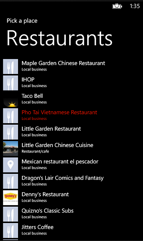

Final Landing Page UI

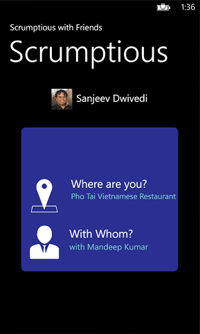

## Publish Open Graph Story

In this tutorial, you'll bring everything together and publish an Open Graph story. The previous steps let the user specify where they are and who they're with. Now, we'll implement a flow that lets the user select a meal and share what they're doing on their timeline.

### Configure Open Graph in the App Dashboard

In this step, you'll define the Open Graph action, object and aggregation in the App Dashboard. Define an _eat_ action with a corresponding _meal_ object. You can define a simple aggregation on the _eat_ action that displays a list of recent meals on the user's timeline. See the [Open Graph Tutorial](https://developers.facebook.com/docs/opengraph/tutorial/#define) to set up your action, object and aggregation.

When you're done with the flow, your Open Graph dashboard should look like this:

Navigate to the Types submenu and select the _Eat_ action in order to update the capabilities in order not to have exceptions about not having them.

Scroll down to the Capabilities section and select the _Place_ and _Tags_ capabilities.

### Set Up Your Backend Server

Open Graph objects need to exist as webpages on a server that Facebook can access. These pages use Open Graph tags that Facebook servers scrape to properly identify the data and connect it to the user. For example, you could have a _pizza_ webpage that represents a _pizza_ instance of a meal. When the user publishes a story with your app, this connects an _eat_ action to the _pizza_ object.

In this tutorial, you'll set up static pages to represent each meal (ex: pizza or hotdog). Let's start by creating a webpage that represents a pizza object. You can start with a very simple webpage and add the appropriate Open Graph markup. Here's the initial HTML:

    <html>
    <head>
    <!-- ADD SAMPLE OBJECT MARKUP CODE HERE -->   
    </head>
    <body>
        <h1>Sample Meal</h1>
    </body>
    </html>

You can get sample object markup code from the App Dashboard > Open Graph > Dashboard tab. Click the Get Code link next to the Meal object to show the sample markup:

Copying the sample code into your HTML should result in code similar to this:

    <html>
    <head prefix="og: http://ogp.me/ns# fb: http://ogp.me/ns/fb# scrumptiousmsft: http://ogp.me/ns/fb/scrumptiousmsft#">
        <meta property="fb:app_id" content="540541885996234" /> 
        <meta property="og:type"   content="scrumptiousmsft:meal" /> 
        <meta property="og:url"    content="Put your own URL to the object here" /> 
        <meta property="og:title"  content="Sample Meal" /> 
        <meta property="og:image"  content="https://fbstatic-a.akamaihd.net/images/devsite/attachment_blank.png" /> 
    </head>
    <body>
        <h1>Sample Meal</h1>
    </body>
    </html>
    
The prefix, fb:app_id and og:type will be different for your code as this corresponds to your Facebook App ID and your Facebook app's namespace.

Replace the following values in the HTML code:

- **Put your own URL to the object here**: replace this with the URL that's you'll use to host your pizza object (ex: https://fbsdkog.herokuapp.com/pizza.html)
- **Sample Meal**: replace this with a title for the object (ex: Pizza)
- **og:image**: replace this with a JPEG or PNG image URL that represents your object

Save the HTML as _pizza.html_ and upload the file to your backend server. Remember you specified the backend server when you provisioned your Facebook App on the Facebook Dev Portal.

Once you've uploaded the HTML page, test the sample object using the [Object Debugger](https://developers.facebook.com/tools/debug). Enter the pizza object URL into the debugger and submit the URL. Fix any errors you find before moving on.

Now that you've set up a pizza object as a webpage, repeat this process for meal objects representing the following: Cheeseburger, Hotdog, Italian, French, Chinese, Thai and Indian.

###Publish a Test Action
Now that you've configured your Open Graph information and set up your objects, try publishing an action outside of your Android app with the Graph API Explorer. Go to the Graph API Explorer and select your app from the ''Application'' list. Then, change the action type from the default ''GET'' to ''POST''. Enter me/<YOUR_APP_NAMESPACE>:eat in the Graph API endpoint field and add the following POST data:

- meal = "OBJECT_URL"
- tags = "FRIEND_USER_ID"
- place = "PLACE_ID" e.g. 111615355559307

Once you enter the additional fields, your form should look like this:

Submit your test action. You should see a response similar to this:

    {
        "id": "4907118722194"
    }

Now, login to Facebook and go to your Activity Log to verify the story posted correctly. You may hit the following error:

    {
        "error": {
            "type": "Exception", 
            "message": "These users can't be tagged by your app: 100002768941660. Either they aren't developers of your app or your action haven't been approved for tagging.", 
            "code": 1611075
        }
    }

The reason for this is that the user you're trying to tag is not an admin, developer or tester for your app. Go the Roles section for your app in the App Dashboard and add the user you want to tag to the appropriate role. You'll have to wait for that user to accept the request for you to add them to your app.

If you ever have issues using Graph API queries in your Windows app test the same queries out using the [Graph API Explorer](https://developers.facebook.com/tools/explorer) tool.
    
### Add the Meal Selection Flow

First, copy the following code to the Constants.cs class, below the _FacebookAppId_ definition:

    public static readonly string FBActionBaseUri = "Base URL for the website where your meal pages exist";
    public static readonly string FacebookAppGraphAction = "<Your namespace>";

After that, add the following Meal class definition in the FacebookDataModel.cs file.

    public class Meal
    {
        public string Name { get; set; }
        public string MealUri { get; set; }
    }

Additionally, add the following ObservableCollection of Meal objects in the _FacebookData_ class, in order to be used for DataBinding in the MealSelector Page that will be created next.

    private static bool isLoadedMeals = false;
    private static ObservableCollection<Meal> meals = new ObservableCollection<Meal>();
    
    public static ObservableCollection<Meal> Meals
    {
        get
        {
            if (!isLoadedMeals)
            {
                
                meals.Add(new Meal { Name = "Pizza", MealUri = Constants.FBActionBaseUri + "pizza.html" });
                meals.Add(new Meal { Name = "Cheeseburger", MealUri = Constants.FBActionBaseUri + "cheeseburger.html" });
                meals.Add(new Meal { Name = "Hotdog", MealUri = Constants.FBActionBaseUri + "hotdog.html" });
                meals.Add(new Meal { Name = "Italian", MealUri = Constants.FBActionBaseUri + "italian.html" });
                meals.Add(new Meal { Name = "French", MealUri = Constants.FBActionBaseUri + "french.html" });
                meals.Add(new Meal { Name = "Chinese", MealUri = Constants.FBActionBaseUri + "chinese.html" });
                meals.Add(new Meal { Name = "Thai", MealUri = Constants.FBActionBaseUri + "thai.html" });
                meals.Add(new Meal { Name = "Indian", MealUri = Constants.FBActionBaseUri + "indian.html" });
                isLoadedMeals = true;
            }

            return meals;
        }
    }

    private static Meal selectedMeal = new Meal { Name = String.Empty, MealUri = String.Empty };
    
    public static Meal SelectedMeal
    {
        get
        {
            return selectedMeal;
        }

        set
        {
            selectedMeal = value;
        }
    }

Now, create another Windows Phone Page in the Pages Folder called MealSelector that will host the Meal Selection ListBox and replace the contents of the MealSelector.xaml with the following XAML code inside it.

    <phone:PhoneApplicationPage
    xmlns="http://schemas.microsoft.com/winfx/2006/xaml/presentation"
    xmlns:x="http://schemas.microsoft.com/winfx/2006/xaml"
    xmlns:phone="clr-namespace:Microsoft.Phone.Controls;assembly=Microsoft.Phone"
    xmlns:shell="clr-namespace:Microsoft.Phone.Shell;assembly=Microsoft.Phone"
    xmlns:d="http://schemas.microsoft.com/expression/blend/2008"
    xmlns:mc="http://schemas.openxmlformats.org/markup-compatibility/2006"
    xmlns:ViewModel="clr-namespace:Facebook.Scrumptious.WindowsPhone.ViewModel"
    x:Class="Facebook.Scrumptious.WindowsPhone.Pages.MealSelector"
    SupportedOrientations="Portrait" Orientation="Portrait"
    mc:Ignorable="d"
    shell:SystemTray.IsVisible="True">

    <phone:PhoneApplicationPage.Resources>
        <ViewModel:FacebookData x:Key="FacebookDataDataSource" d:IsDataSource="True"/>
        <DataTemplate x:Key="MealTemplate">
            <Grid Width="456">
                <TextBlock x:Name="MealName" HorizontalAlignment="Left" TextWrapping="Wrap" Text="{Binding Name}" VerticalAlignment="Top" FontSize="26.667"/>
            </Grid>
        </DataTemplate>
        
        
    </phone:PhoneApplicationPage.Resources>
    <phone:PhoneApplicationPage.FontFamily>
        <StaticResource ResourceKey="PhoneFontFamilyNormal"/>
    </phone:PhoneApplicationPage.FontFamily>
    <phone:PhoneApplicationPage.FontSize>
        <StaticResource ResourceKey="PhoneFontSizeNormal"/>
    </phone:PhoneApplicationPage.FontSize>
    <phone:PhoneApplicationPage.Foreground>
        <StaticResource ResourceKey="PhoneForegroundBrush"/>
    </phone:PhoneApplicationPage.Foreground>

    <!--LayoutRoot is the root grid where all page content is placed-->
    <Grid x:Name="LayoutRoot" Background="Transparent" DataContext="{Binding Source={StaticResource FacebookDataDataSource}}">
        <Grid.RowDefinitions>
            <RowDefinition Height="Auto"/>
            <RowDefinition Height="*"/>
        </Grid.RowDefinitions>

        <!--TitlePanel contains the name of the application and page title-->
        <StackPanel Grid.Row="0" Margin="12,17,0,28">
            <TextBlock Text="Pick Meal" Margin="9,-7,0,0" Style="{StaticResource PhoneTextTitle1Style}"/>
        </StackPanel>

        <!--ContentPanel - place additional content here-->
        <Grid x:Name="ContentPanel" Grid.Row="1" Margin="12,0,12,0">
            <ListBox x:Name="MealSelectionListBox" HorizontalAlignment="Left" VerticalAlignment="Top" Width="456" ItemsSource="{Binding Meals}" ItemTemplate="{StaticResource MealTemplate}" Style="{StaticResource MealListBoxStyle}" ItemContainerStyle="{StaticResource MealListBoxItemStyle}" SelectionChanged="MealSelectionListBoxSelectionChanged"/>

        </Grid>
    </Grid>

    </phone:PhoneApplicationPage>

Also, add the following event handler in _MealSelector.xaml.cs_ file and resolve the missing dependencies to note down the selected meal to the ViewModel.

    private void MealSelectionListBoxSelectionChanged(object sender, SelectionChangedEventArgs e)
    {
        if (this.MealSelectionListBox.SelectedItem != null)
        {
            FacebookData.SelectedMeal = (Meal)this.MealSelectionListBox.SelectedItem;
        }
    }

Now, add the following XAML to the _LandingPage.xaml_ just above the Grid named _WhereAreYouEatingGrid_ to add the UI elements to allow navigating to the MealSelector Page:

    <Grid x:Name="WhatDidYouEatGrid" HorizontalAlignment="Left" Height="100" VerticalAlignment="Top" Grid.Row="0" >
        <Grid.ColumnDefinitions>
            <ColumnDefinition Width="81*"/>
            <ColumnDefinition Width="107*"/>
        </Grid.ColumnDefinitions>
        <Image Grid.Column="0" HorizontalAlignment="Left" Height="80" VerticalAlignment="Top" Width="100" Source="/Images/Cafe.png" Margin="0,10,0,0"/>
        <StackPanel Orientation="Vertical" Grid.Column="1" Margin="15,0,0,0">
            <TextBlock x:Name="WhatDidYouEat" HorizontalAlignment="Left" TextWrapping="Wrap" Text="What are you eating?" VerticalAlignment="Top" FontSize="24"/>
            <TextBlock x:Name="MealName" HorizontalAlignment="Left" TextWrapping="Wrap" Text="Select One" VerticalAlignment="Top" Tap="MealName_Tap" Foreground="#FF7CC8D4"/>
        </StackPanel>
    </Grid>
 
Also, add the following code to the _LandingPage.xaml.cs_ file to navigate to the MealSelector page:

    private void MealName_Tap(object sender, System.Windows.Input.GestureEventArgs e)
    {
        NavigationService.Navigate(new Uri("/Pages/MealSelector.xaml", UriKind.Relative));
    }

Finally, add the following code to the _OnNavigatedTo_ event handler in _LandingPage.xaml.cs_ to pick up the selected Meal once the meal selection has happened and the user navigates back to the LandingPage:

    if (!String.IsNullOrEmpty(FacebookData.SelectedMeal.Name))
    {
        this.MealName.Text = FacebookData.SelectedMeal.Name;
    }

If you  followed the tutorial correctly, you should, at this point be able to run the application and see the following additional UI:

Meal Selection Page

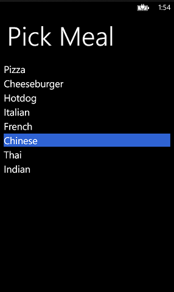

Finished Landing Page

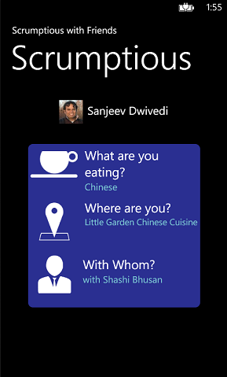

### Add the Publish Action Button

In this step, you'll finish setting up the UI by adding a submit button that publishes the Open Graph action through your app.

Add the following code to LandingPage.xaml directly as a descendent of _<phone:PhoneApplicationPage>_ node to add an Appbar button for posting the Open Graph Action to Facebook:

    <!--Sample code showing usage of ApplicationBar-->
    <phone:PhoneApplicationPage.ApplicationBar>
        <shell:ApplicationBar IsVisible="True" IsMenuEnabled="False">
            <shell:ApplicationBarIconButton IconUri="/Images/share.png" Text="Share" Click="PostActionToFBHandler"/>
            <!--<shell:ApplicationBarIconButton IconUri="/Images/appbar_button2.png" Text="Button 2"/>-->
            <!--<shell:ApplicationBar.MenuItems>
                <shell:ApplicationBarMenuItem Text="MenuItem 1"/>
                <shell:ApplicationBarMenuItem Text="MenuItem 2"/>
            </shell:ApplicationBar.MenuItems>-->
        </shell:ApplicationBar>
    </phone:PhoneApplicationPage.ApplicationBar>

Finally, add the following code to LandingPage.xaml.cs to request _publish\_stream_ permissions from the user to get publish access to the user's timeline, post the Open Graph Action to Facebook and show a MessageDialog on success. Resolve all the missing dependencies.

    async private void PostActionToFBHandler(object sender, EventArgs evtArgs)
    {
        if (FacebookData.SelectedFriends.Count < 1
            || FacebookData.SelectedMeal.Name == String.Empty
            || FacebookData.IsRestaurantSelected == false)
        {
            MessageBox.Show("Please select friends, a place to eat and something you ate before attempting to share!");
            return;
        }

        FacebookSession session;
        string message = String.Empty;
        try
        {
            session = await App.FacebookSessionClient.LoginAsync("publish_stream");
        }
        catch (InvalidOperationException e)
        {
            message = "Login failed! Exception details: " + e.Message;
            MessageBox.Show(message);
            return;
        }

        FacebookClient fb = new FacebookClient(App.AccessToken);

        fb.PostCompleted += (o, e) =>
        {
            if (e.Error != null)
            {
                Dispatcher.BeginInvoke(() => MessageBox.Show(e.Error.Message));
                return;
            }

            var result = (IDictionary<string, object>)e.GetResultData();

            Dispatcher.BeginInvoke(() =>
            {
                MessageBox.Show("Posted Open Graph Action, id: " + (string)result["id"], "Result", MessageBoxButton.OK);

                // reset the selections after the post action has successfully concluded
                this.MealName.Text = "Select One";
                this.restaurantLocationTextBlock.Text = "Select One";
                this.WithWhoTextBox.Text = "Select Friends";
            });
        };

        fb.PostAsync( String.Format("/me/{0}:eat", Constants.FacebookAppGraphAction), new { meal = FacebookData.SelectedMeal.MealUri, tags = FacebookData.SelectedFriends[0].id, place = FacebookData.SelectedRestaurant.Id});
    }

The above code simply posts to _/me/scrumptiousmsft:eat_ url with the meal, friend's id and the location of the restaurant using the PostTaskAsync API once the publish_permissions are granted by the user.

> **Note**: Look at the Open Graph API for reference on how to fetch and post various kinds of data. Use the GetDataAsync or PostDataAsync to retrieve/send data to the URL depending on what operation the API supports. Passing the parameters is pretty easy by just creating a new object with properties set to the parameter names etc. There is no need to pre-create these objects.

If you followed the tutorial correctly, at this step you should be able to run and publish the action to Facebook and see the following UI:

AppBar with the Post icon to post an action to Facebook:

Ask for publish permissions:

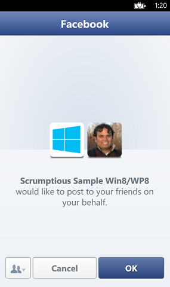

Response from Facebook:

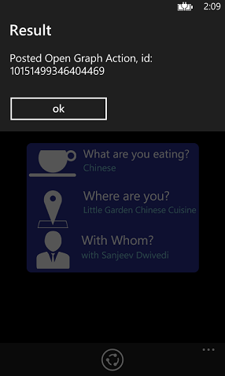

Congratulations, you just finished the Windows Phone tutorial.