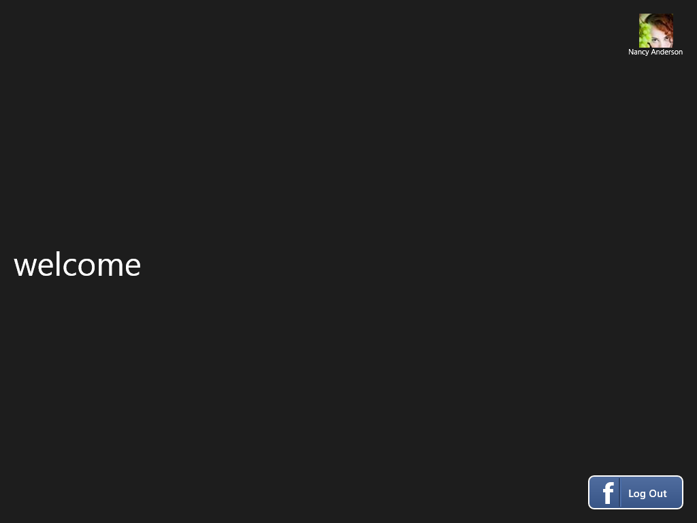
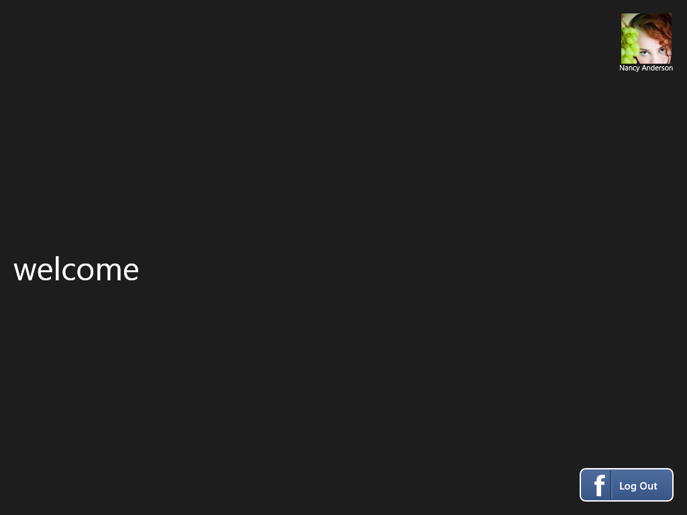

In this document:

* [Overview](#1)
* [Using the ProfilePicture Control](#2)
* [See Also](#3)

---

## Overview

The ProfilePicture control displays the profile picture of a Facebook object such as a user, place or event.

|Not Logged In|&nbsp;&nbsp;&nbsp;Logged In&nbsp;&nbsp;&nbsp;|
|--------|--------|
|||

---

## Using the ProfilePicture Control

In this tutorial, you will add a [ProfilePicture](/docs/reference/client/Client.Controls.ProfilePicture.html) control to an application to display the picture of the logged in user. This tutorial builds on top of the [LoginButton control tutorial](/docs/windows/controls/login-ui-control/), which you need to complete before proceeding; in particular, you should have already added the **Facebook.Client NuGet** to your project as well as inserted and configured a [LoginButton](/docs/reference/client/Client.Controls.LoginButton.html) in your page.

1.	Open the **MainPage.xaml** page of the application that you created for the [LoginButton control tutorial](/docs/windows/controls/login-ui-control/). 

1.	In the user information area in the top row, locate the **StackPanel** element and insert a [ProfilePicture](/docs/reference/client/Client.Controls.ProfilePicture.html) control as its first child element, as shown below.
 
	

1.	If you switch to Design view, you will notice that the control displays a silhouette image, indicating that no picture is currently available. 
 
	

1.	To display a picture, the control requires a profile ID to be configured. This can be the ID of any Facebook object, such as a user, a place, or an event. For this tutorial, configure the ID of the currently logged in user by binding the control’s **ProfileID** property to the **FacebookId** property of the **CurrentUser** object provided by the **LoginButton** control. This property is initialized once the user opens a session. Add the property and configure the binding as shown below.
 
	

	Access to profile pictures can be rate limited to prevent abuse. To avoid running into any restrictions, the [ProfilePicture](/docs/reference/client/Client.Controls.ProfilePicture.html) control includes an **AccessToken** property. If this property is initialized with a valid token, this token is passed along with the request, thus avoiding rate limits. However, for this tutorial, this additional measure will not be necessary.

1.	Run the application and log in. Notice how your profile image is displayed in the upper right corner of the page.
 
	

1.	You can customize the profile picture by changing its display size.  To change the size, set the value of the control’s **Width** and **Height** properties to _75_. The control ensures that the image it retrieves is large enough to preserve its quality.
 
	

	

1.	By default, the [ProfilePicture](/docs/reference/client/Client.Controls.ProfilePicture.html) control displays a cropped square version of the image. To display a scaled version of the original image, set the **CropMode** property to _Original_.
 
	
	
	

	Note that there is an additional _Fill_ **CropMode** setting that will resize the image to fill the control area while preserving its original aspect ratio.

1.	The complete XAML for the page is shown below. Compare it with your work to verify that you have followed the steps of the tutorial correctly.

        <Page
            x:Class="FacebookControls.MainPage"
            xmlns="http://schemas.microsoft.com/winfx/2006/xaml/presentation"
            xmlns:x="http://schemas.microsoft.com/winfx/2006/xaml"
            xmlns:local="using:FacebookControls"
            xmlns:d="http://schemas.microsoft.com/expression/blend/2008"
            xmlns:mc="http://schemas.openxmlformats.org/markup-compatibility/2006"
            xmlns:facebookControls="using:Facebook.Client.Controls"
            mc:Ignorable="d">

            <Grid Background="{StaticResource ApplicationPageBackgroundThemeBrush}">
                <Grid Margin="20">
                    <Grid.RowDefinitions>
                        <RowDefinition Height="Auto"/>
                        <RowDefinition/>
                        <RowDefinition Height="Auto"/>
                    </Grid.RowDefinitions>

                    <!--user information-->
                    <StackPanel HorizontalAlignment="Right">
                        <facebookControls:ProfilePicture 
                            x:Name="profilePicture"
                            Width="75" 
                            Height="75" 
                            CropMode="Original" 
                            ProfileId="{Binding CurrentSession.FacebookId, ElementName=loginButton}" />
                        <TextBlock 
                            HorizontalAlignment="Center"
                            Text="{Binding CurrentUser.Name, ElementName=loginButton}" />
                    </StackPanel>
            
                    <!--ContentPanel - place additional content here-->
                    <Grid x:Name="ContentPanel" 
                        Grid.Row="1"
                        Visibility="Collapsed">
                        <TextBlock FontSize="48" 
                                   HorizontalAlignment="Left" 
                                   VerticalAlignment="Center" 
                                   Text="welcome"/>
                    </Grid>

                    <!-- login control -->
                    <facebookControls:LoginButton 
                        x:Name="loginButton" 
                        Grid.Row="2" 
                        HorizontalAlignment="Right" 
                        ApplicationId="[INSERT-YOUR-FACEBOOK-APPLICATION-ID-HERE]" 
                        SessionStateChanged="OnSessionStateChanged" />
                </Grid>
            </Grid>
        </Page>

1.	Run the application again to see the result of your latest changes.

	 

---

## See Also

