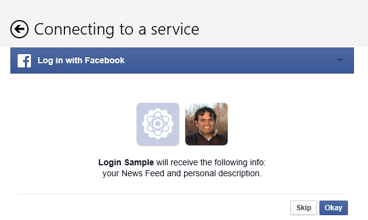
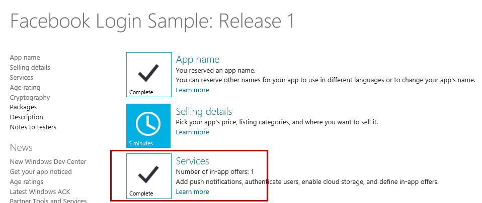

##Introduction

Facebook Login in Windows Store apps with Single Sign On allows your users to login into any app on the system once using the[WebAuthenticationBroker](http://msdn.microsoft.com/en-us/library/windows/apps/windows.security.authentication.web.webauthenticationbroker.aspx) built into Windows. If another application then wants to access the users facebook account, the user need only provide consent and does not have to sign in again. The Single Sign On experience is provided in a secure manner by the [WebAuthenticationBroker](http://msdn.microsoft.com/en-us/library/windows/apps/windows.security.authentication.web.webauthenticationbroker.aspx) by making sure that Windows Store Apps can be uniquely and safely identified using the Package Security Identifier that Windows assigns to each app.

 Lets take a look at the user experience.  The first time the user connects to facebook they would see this.

In this case the user would provide their credentials.  If they check **keep me logged in** then when the next application, which could be yours, requests access to facebook, the user will not have to provide their credentials again.  Instead the user will see the following. 

All the user needs to do is agree to give your application access to the specific information and capabilities provided by facebook.  Once the user authorizes your application, it can continue to access the requested information with no further prompts.   

In this post, we will walk  you through the steps on how to setup your applications for a Single Sign On with [WebAuthenticationBroker](http://msdn.microsoft.com/en-us/library/windows/apps/windows.security.authentication.web.webauthenticationbroker.aspx) for Windows Store apps.

## Setting up on Windows Store app on Facebook
*	Log on to the Facebook developer portal (https://developers.facebook.com) and navigate to your application. Click Edit App or Create new app 

 
*	Next, look for the following section on the resulting page, which specifies the place to integrate the Windows Store app setup for Login with Facebook:

The Windows Store ID box is the place where you need to enter the App ID for your Windows Store app. To obtain the Windows Store ID for your app and to continue integrating the Login with Facebook in a Single Sign On manner, login to your Windows Store Account at the [Dev Portal](https://appdev.microsoft.com/storeportals) and follow through the rest of the steps.

## Getting Package Security Identifier (SID) from Windows Store dev portal

*	Once you are logged on to Windows Store Developer portal at the link specified in the above step, locate your app on the dashboard and click the Edit link below that :
 

 
*	Following the above step will lead you to the page containing the details for the app. Once on this page, click on the Services section 

 

*	On the page that results from above step, Click the Live Services site in there 

 

*	On the resulting page, click the Authenticating your service link 

*	On the resulting page, the highlighted string in Figure 7 is the the Package Security Identifier or Package SID that you need for the Single Sign On. Note: You should drop the **ms-app://** prefix preceding the Package SID when copying the SID to the Facebook portal.
 

 
*	Finally, once you have obtained the Package Security Identifier (SID) and copied it over to the Facebook dev portal as specified in Step 1, you simply need to make the WebAuthenticationBroker.authenticateAsync call with the startUri parameter set to include your Package SID as the redirect URL.  Make sure you use the two parameter version of authenticateAsync function instead of the three parameter version with the callback URI. If your app uses Login with Facebook, currently in the startURI parameter, you are likely using the redirect URI as www.facebook.com/connect/login_success.html and you need it to change to your Package SID. Specifically, change the startURI in the authenticateAsync call so that it would change 

From:

https://www.facebook.com/dialog/oauth?client_id=<Your Facebook App ID>&display=popup&response_type=token&redirect_uri=**www.facebook.com/connect/login_success.html** 
 
To:

https://www.facebook.com/dialog/oauth?client_id=<Your Facebook App ID>&display=popup&response_type=token&redirect_uri=**ms-app://[Your Windows Store Package SID]/**

Its just that easy!

## Summary

Login with Facebook using Single Sign On via the WebAuthenticationBroker in Windows Store apps offers your users a simple and convenient way of logging into your applications.  This enables you to easily provide rich and personalized experiences and take advantage of the viral effect of your users social network. To learn how to do so, you can leverage the Facebook C# SDK for Windows Store apps and Windows Phone apps. Check out the Facebook Open Graph APIs that allow you to programmatically publish stories to a user’s Timeline to create personalized user experiences. You can also visit [Facebook Developer Portal](http://developers.facebook.com) to learn more about the Facebook social platform and other ways of integrating social functionality in your apps. Also check out the [Facebook app based login](/docs/phone/sso) functionality for Windows Phone 8 which offers similar experience for the Phone platform.

