##Introduction

This multipart tutorial walks you through integrating Facebook into a C#/XAML based Windows Store app. You'll create a timeline app that lets people post about meals they ate.

This sample app is based on the Scrumptious sample app provided by Facebook for other mobile platforms.  The completed sample is present at [https://github.com/facebook-csharp-sdk/facebook-windows8-sample.git](https://github.com/facebook-csharp-sdk/facebook-windows8-sample.git "https://github.com/facebook-csharp-sdk/facebook-windows8-sample.git") Once you clone the repository, open the project Facebook.Scrumptious.Windows8 This is how the completed sample should look like. 

Facebook Login page

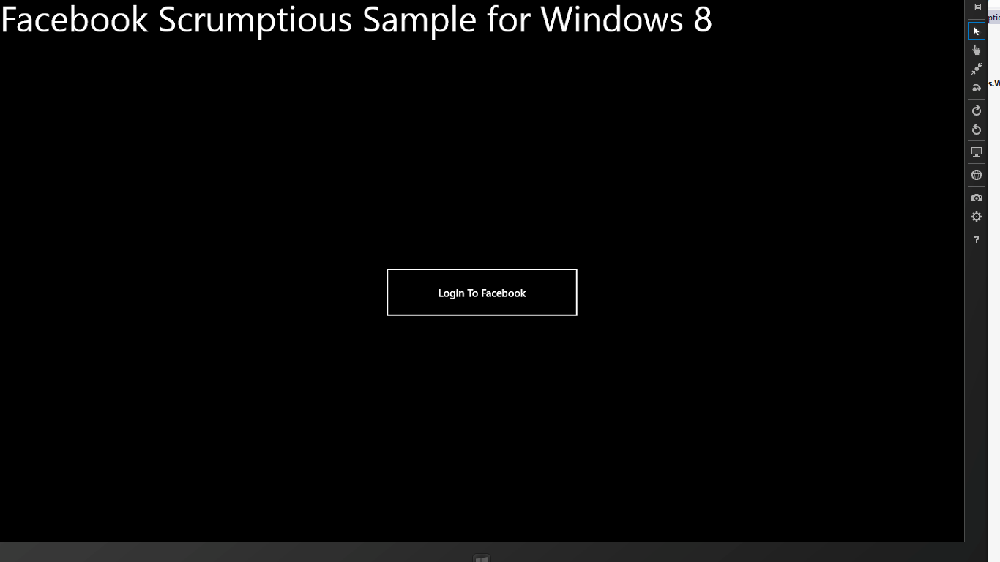

Scrumptious Landing Page

Posted event on your timeline

To complete the tutorial, you'll need some familiarity with Windows Store development. In particular, you will need familiarity with Visual Studio 2012 and being able to create and debug Windows Store projects in C# and XAML. Familiarity with Expression Blend for Visual Studio will be of additional benefit.

### Setting up your Facebook Application
Before you can get started with the Windows 8 Application, you have to create a _Facebook Application_ and obtain a Facebook AppId on the Facebook developer portal. To do this, first you need to go to [Facebook Developer Portal](http://developers.facebook.com/apps) and create a Facebook App.

Once you have created the app, you need to edit the app and change a few settings. Make sure to set the _DisplayName_ and _namespace_ appropriately. Also, make sure to set the _email address_. One of the crucial things is the _App Domain_ box. In this box, you should add a domain without the _http://_ prefix. Make sure you have control of the website because later in this tutorial, you will need to place some static pages there. As of yet, Facebook does not have a dedicated section for Windows 8/WP8, so for now, select the section "Website with Facebook Login". in the _Site URL_ field, put the website that you earlier picked for the App Domain, except make sure that you prefix it with an "https://" this time. Don't worry,  you will not have to configure your website with a real SSL functionality. This is just to make the _Facebook Website with Facebook Login_ dialog happy.

> ATTENTION: You may have to wait 5-10 minutes for the App you just created to propagate through the Facebook system before it becomes Active. If your app's facebook login is not working immediately after you created the App, give it 10 minutes and try again.

### Getting Started on the Application
To get started, create a Visual Studio project using the Visual C# -> Windows Store -> Blank App. Let us call our app the Facebook.Scrumptious.Windows8. Install the Facebook nuget package into the solution by starting the Package Manager powershell by following:

Tools->Library Package Manager->Package Manager console

Once the powershell command prompt is running, type

"Install-Package Facebook"

This will download the nuget package and install the SDK into your project and add it to the references.

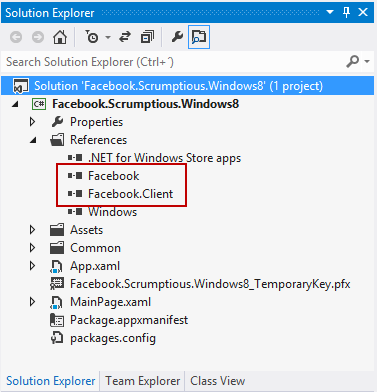

Once you've done that, work through the following steps of the tutorial:

*	Authenticate: Implement Facebook Login and ask the user for the permissions your app needs.
*	Personalize: Personalize the user's experience with their profile picture and name when they log in.
*	Show Friends: Display the user's friend list and let them select one or more friends.
*	Show Nearby Places: Display a list of nearby places and let the user tag their location.
*	Publish an Open Graph Action: Publish activity from your app to timeline and news feed, and set up the back-end server for Open Graph objects.

By the end of this tutorial, you should have a working understanding of how to log a user into to Facebook, personalize their experience and make an app social. Let's start the tutorial.

##Authenticate

###Setup the project

Create two folders called ViewModel and  Views in the project. This is how it will look like:

Delete the MainPage.xaml and MainPage.xaml.cs from the project. We will keep all our views in the Views Folder. Right click on the "Views" folder and select "Add New Item".  

Select Blank Page and name it HomePage.xaml. This page will host our Facebook login button.

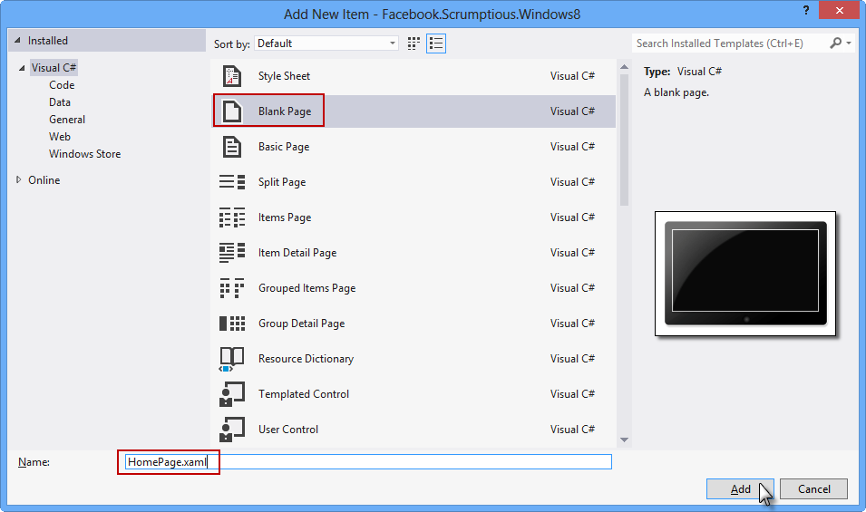

Now in App.xaml.cs, change where it says MainPage to HomePage. This will make the application use the HomePage as the default page to start up with.

    if (!rootFrame.Navigate(typeof(MainPage), args.Arguments))

to 

    if (!rootFrame.Navigate(typeof(HomePage), args.Arguments))

This will show a Red line under the HomePage showing Visual Studio does not know where HomePage class is located. This can easily be resolved by right clicking on HomePage and selecting 'Resolve". 

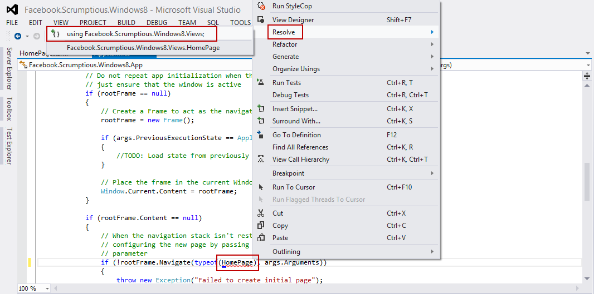

You can also resolve this  by manually typing:

    using Facebook.Scrumptious.Windows8.Views; 

at the top of the page. In future references, I will assume that you know how to resolve a reference.

The HomePage will host our Facebook login button and the Facebook login code.

At this point, we will additionally add another page that we want to navigate to once the authentication has succeeded. To do so, just like before add another page using "Add new Item". This time, select Visual C# on the left in the Add Dialog and then select "Basic Page" in the middle pane. Name this page "LandingPage.xaml" 

This will show a prompt saying that to satisfy dependencies, more files will be automatically added. Say yes to this. This steps automatically adds files that allow easy navigation within Windows Store apps by providing Navigation Stack functionality. It automatically adds a back button to the landing page as well. The dependencies are brought in only once, so once you have added them, the next time you add a Basic page, you will not need to add them again. In future references, I will assume you know how to add Pages to the Views folder.

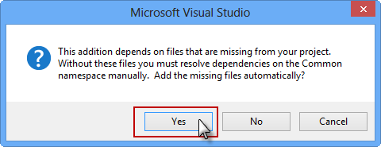

### Setup the User Interface

In App.xaml.cs add the following two variables to hold the Facebook OAuth Access Token and the User's ID once they have logged in into Facebook:

    internal static string AccessToken = String.Empty;
    internal static string FacebookId = String.Empty;

Now Replace the contents of HomePage.xaml with the following. All the following does is to add some text to the Page and a button for facebook login. Additionally, it says that the button click will be handled by an event handler named "btnFacebookLogin_Click".
    
    <Page
        x:Class="Facebook.Scrumptious.Windows8.Views.HomePage"
        xmlns="http://schemas.microsoft.com/winfx/2006/xaml/presentation"
        xmlns:x="http://schemas.microsoft.com/winfx/2006/xaml"
        xmlns:local="using:Facebook.Scrumptious.Windows8.Views"
        xmlns:d="http://schemas.microsoft.com/expression/blend/2008"
        xmlns:mc="http://schemas.openxmlformats.org/markup-compatibility/2006"
        mc:Ignorable="d">
    
        <Grid>
    
            <Grid.RowDefinitions>
                <RowDefinition Height="Auto"/>
                <RowDefinition Height="*"/>
            </Grid.RowDefinitions>
            <TextBlock Text="Facebook Scrumptious Sample for Windows 8" FontSize="50"/>
            <Button Grid.Row="1" Content="Login To Facebook" Height="73" HorizontalAlignment="Center" Name="btnFacebookLogin" VerticalAlignment="Center" Width="276" Click="btnFacebookLogin_Click" />
    
        </Grid>
    </Page>

In HomePage.xaml.cs, add the following two internal variables. The _permissions_ variable to hold a reference to all the extended permissions our application will require i.e. ability to access the user's profile, the ability to read their news feed and the publish to their news feed. The _fb_ variable of type FacebookClient to instantiate the SDK defined facebook client that we will use in the rest of the tutorial to interact with the Facebook APIs. 

    string _permissions = "user_about_me,read_stream,publish_stream";
    FacebookClient _fb = new FacebookClient();
    
Additionally, add the following code which defines the event handlers for the facebook login button. The following code

        private async void btnFacebookLogin_Click(object sender, RoutedEventArgs e)
        {
            var redirectUrl = "https://www.facebook.com/connect/login_success.html";
            try
            {
                //fb.AppId = facebookAppId;
                var loginUrl = _fb.GetLoginUrl(new
                {
                    client_id = Constants.FacebookAppId,
                    redirect_uri = redirectUrl,
                    scope = _permissions,
                    display = "popup",
                    response_type = "token"
                });

                var endUri = new Uri(redirectUrl);

                WebAuthenticationResult WebAuthenticationResult = await WebAuthenticationBroker.AuthenticateAsync(
                                                        WebAuthenticationOptions.None,
                                                        loginUrl,
                                                        endUri);
                if (WebAuthenticationResult.ResponseStatus == WebAuthenticationStatus.Success)
                {
                    var callbackUri = new Uri(WebAuthenticationResult.ResponseData.ToString());
                    var facebookOAuthResult = _fb.ParseOAuthCallbackUrl(callbackUri);
                    var accessToken = facebookOAuthResult.AccessToken;
                    if (String.IsNullOrEmpty(accessToken))
                    {
                        // User is not logged in, they may have canceled the login
                    }
                    else
                    {
                        App.AccessToken = accessToken;

                        // User is logged in and token was returned
                        LoginSucceded();
                    }

                }
                else if (WebAuthenticationResult.ResponseStatus == WebAuthenticationStatus.ErrorHttp)
                {
                    throw new InvalidOperationException("HTTP Error returned by AuthenticateAsync() : " + WebAuthenticationResult.ResponseErrorDetail.ToString());
                }
                else
                {
                    // The user canceled the authentication
                }
            }
            catch (Exception ex)
            {
                //
                // Bad Parameter, SSL/TLS Errors and Network Unavailable errors are to be handled here.
                //
                throw ex;
            }
        }

Also add the following code to set the User's FacebookId in _App.FacebookId_ and to navigate to the LandingPage when the login has succeeded:
 
        private async void LoginSucceded()
        {
            FacebookClient _fb = new FacebookClient(App.AccessToken);

            dynamic parameters = new ExpandoObject();
            parameters.access_token = App.AccessToken;
            parameters.fields = "id";

            dynamic result = await _fb.GetTaskAsync("me", parameters);

            App.FacebookId = result.id;
            Frame.Navigate(typeof(LandingPage));
        }

At this step, also add a new item of type _class_ to the _ViewModel_ folder. Call the class _Constants.cs_ and add the following code to it. Make sure to replace the string _Your Facebook App ID here_ with your Facebook App ID that you obtained earlier when you created your app on the Facebook Developer Portal.

    class Constants
    {
        public static readonly string FacebookAppId = "Your Facebook App ID here";
    }

        
Make sure to resolve any missing dependencies as illustrated earlier to ensure that the code builds without errors. You should now be able to run the app and login to Facebook. You should also see the dialog to add extended permissions. When executed, your app should present you with the following dialogs. When you are successfully logged in, you should be naviated to a blank page - LandingPage.

Login Page

Basic Permissions Page

Extended Permissions Page

[Todo] Logout - reset App.AccessToken = String.Empty

##Personalize

This tutorial outlines how to personalize your app experience with the Facebook SDK for Windows 8 by displaying the user's profile picture and name.

### Setup the UI. 

Insert the following code to LandingPage.xaml with the following content, which merely adds an image control and a TextBlock to hold the User's profile picture and name. Make sure to insert this right after the declaration of the back button and page title Grid:

        <Grid Grid.Row="1">
            <Grid.ColumnDefinitions>
                <ColumnDefinition Width="208*"/>
                <ColumnDefinition Width="475*"/>
            </Grid.ColumnDefinitions>
            <StackPanel HorizontalAlignment="Center" VerticalAlignment="Center">
                <Image x:Name="MyImage" Height="100" Width="100"/>
                <TextBlock x:Name="MyName" TextWrapping="Wrap" Text="TextBlock" FontFamily="Segoe UI" FontSize="29.333"/>
            </StackPanel>
        </Grid>
        
Also, give a correct name to the page by changing the AppName from _My Application_ to _Scrumptious_ in the XAML file.

### Retrieve the User's profile data and display it

At this point, the user has been Authenticated and their AccessToken and FacebookId is stored in App.xaml.cs static variables and hence it is available throughout the program. Now copy the following code into LandingPage.xaml.cs:

        private async void LoadUserInfo()
        {
            FacebookClient _fb = new FacebookClient(App.AccessToken);

            dynamic parameters = new ExpandoObject();
            parameters.access_token = App.AccessToken;
            parameters.fields = "name";

            dynamic result = await _fb.GetTaskAsync("me", parameters);

            string profilePictureUrl = string.Format("https://graph.facebook.com/{0}/picture?type={1}&access_token={2}", App.FacebookId, "large", _fb.AccessToken);

            this.MyImage.Source = new BitmapImage(new Uri(profilePictureUrl));
            this.MyName.Text = result.name;
        }
        
The above code retrieves the user profile data. It additionally creates a URL for the user's profile picture and sets it as the source of the image. This causes the image to automatically retrieve the profile picture and load it correctly.

As a Final step in personalization, we have to invoke the function as soon as the page has been loaded. To do this, add the following line in the Constructor after the InitializeComponent call:

    LoadUserInfo();
            
As before, make sure to resolve any missing dependencies as illustrated earlier to ensure that the code builds and runs without errors. At the end of this step, your UI for landing page will look like the following:

##Show Friends

### Creating the UI

Download the file [dl]: Assets/icons.zip to get the icons for the tutorial. Uncompress the file and drag all the icons to the Assets folder in Visual Studio project window.

After that, add the following code to LandingPage.xaml. This adds an icon and Text for _Selecting Friends_. Additionally, it wires up the tap event on the _Select Friends_ TextBlock via an event handler named selectFriendsTextBox_Tapped.

            <StackPanel Grid.Column="1" Margin="10,0,0,0" VerticalAlignment="Center">
                <Grid x:Name="WithWhomGrid" >
                    <Grid.ColumnDefinitions>
                        <ColumnDefinition Width="150"/>
                        <ColumnDefinition Width="
						*"/>
                    </Grid.ColumnDefinitions>
                    <Image HorizontalAlignment="Center" Height="150" VerticalAlignment="Center" Width="150"  Grid.Column="0" Stretch="None" Source="ms-appx:///Assets/PersonWin8.png" />
                    <StackPanel Grid.Column="1">
                        <TextBlock TextWrapping="Wrap" Text="With Whom?" FontFamily="Segoe UI" FontSize="48"/>
                        <TextBlock x:Name="selectFriendsTextBox" TextWrapping="Wrap" Text="Select Friends" FontFamily="Segoe UI" FontSize="26.667" Foreground="#FF6DB7C7" Tapped="selectFriendsTextBox_Tapped"/>
                    </StackPanel>
                </Grid>
            </StackPanel>

We will now make the app a bit more interactive and let the user pick out their friends.

### Create the ViewModel class

Create an static ObservableCollection of friends that you will later use to connect the UI to the data. Making it ObservableCollection allows you to use one of the strongest points of XAML, data binding.
In the ViewModel folder, create a new item of type Class and set its name to be _FacebookDataModel.cs_ Inside this file, remove the class FacebookDataModel and paste the following code which defines a class representing a _Facebook Friend_. We are also declaring an _ObservableCollection of Friend_ inside another class called _FacebookData_ which will represent the list of our friends. Declaring this as an _ObservableCollection_ has the added advantage that we can use Expression Blend to easily bind the collection data to the UI without having to write complicated DataModel<->UI synchronization logic.

        public class Friend
        {
            public string id { get; set; }
            public string Name { get; set; }
            public Uri PictureUri { get; set; }
        }

        public class FacebookData
        {
            private static ObservableCollection<Friend> friends = new ObservableCollection<Friend>();
            public static ObservableCollection<Friend> Friends
            {
                get
                {
                    return friends;
                }
            }
        }

### Create the Friend Picker Page
To the Views directory, add a Basic Page called FriendSelector.xaml. This page will hold the UI for showing and picking friends.

Now finally, create the handler for the tapping event on the _Select Friends_ text box. Paste the following in the LandingPage.xaml.cs, which brings down the list of friends from Facebook.

        async private void selectFriendsTextBox_Tapped(object sender, TappedRoutedEventArgs evtArgs)
        {
            FacebookClient fb = new FacebookClient(App.AccessToken);

            dynamic friendsTaskResult = await fb.GetTaskAsync("/me/friends");
            var result = (IDictionary<string, object>)friendsTaskResult;
            var data = (IEnumerable<object>)result["data"];
            foreach (var item in data)
            {
                var friend = (IDictionary<string, object>)item;

                FacebookData.Friends.Add(new Friend { Name = (string)friend["name"], id = (string)friend["id"], PictureUri = new Uri(string.Format("https://graph.facebook.com/{0}/picture?type={1}&access_token={2}", (string)friend["id"], "square", App.AccessToken)) });
            }

            Frame.Navigate(typeof(FriendSelector));
        }

Let's take a deeper look at the code to fetch the list of Friends. The following line follows the async/await pattern in .NET 4.5, which is to say, that the GetTaskAsync function suspends execution of the selectFriendsTextBox_Tapped function and waits for the results of GetTaskAsync function to become available. One more thing to note is that the type of friendsTaskResult is _dynamic_ which means that the actual type of the variable will be interpreted at runtime. If the operation being performed on the data type is not valid, the runtime will issue an error.

        dynamic friendsTaskResult = await fb.GetTaskAsync("/me/friends");

Thus, when we want to unravel the friendsTaskResult, we have to understand it's schema. The [Graph Explorer on facebook](https://developers.facebook.com/tools/explorer/) is an invaluable tool for this purpose. Navigate to the above Graph Explorer website, login and fetch the URL _/me/friends_ to see how facebook sends the data back in JSON format:

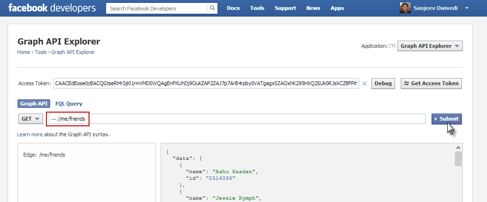

The data returned is similar to the following:
        
        {
            "data": [
                        {
                            "name": "Ashu Razdan", 
                            "id": "2516036"
                        }, 
                        {
                            "name": "Jessie Rymph", 
                            "id": "3103754"
                        }
                    ]
        }
    
You can navigate data similar to above using _dynamic_ data type and _dictionaries_ pretty simply as shown below. The following typecasts the dynamic data returned into a dictionary of _<string,object>_. From that, we retrieve the value corresponding to the key _data_ in the dictionary.

        var result = (IDictionary<string, object>)friendsTaskResult;
        var data = (IEnumerable<object>)result["data"];
            
Following similar logic, we can retrieve each of our friends as a single object in the _foreach_ statement. Once we have obtained each object, we again typecast it to another dictionary and pick up the individual properties as shown below. This style of parsing data allows you to pick data from JSON objects without needing to create DeSerializer classes. We now, create _Friend_ objects and add them to the _static ObservableCollection_ named _Friends_ in the _FacebookData_ class. We will shortly use this Collection to create our Friend Selector page.

            foreach (var item in data)
            {
                var friend = (IDictionary<string, object>)item;

                FacebookData.Friends.Add(new Friend { Name = (string)friend["name"], id = (string)friend["id"], PictureUri = new Uri(string.Format("https://graph.facebook.com/{0}/picture?type={1}&access_token={2}", (string)friend["id"], "square", App.AccessToken)) });
            }
            
### Create the Friend Picker

Now that we have the Friends list as an ObservableCollection, we can create and bind it to the  UI using code, but it is much easier doing that using Expression Blend, so let's instead do that. To use Expression Blend on the project, right click on the project in Visual Studio and select _Open in Blend_. 

>NOTE: Expression blend is one of the tools that makes developing UI in XAML extremely easy. Additionally, binding list data to UI becomes extremely easy with Blend. It is worth learning Expression Blend if you plan to do any long term development in C#/XAML. A good resource for learning Expression Blend is [Pro Expression Blend](http://www.amazon.com/Pro-Expression-Blend-Andrew-Troelsen/dp/143023377X/ref=sr_1_1?ie=UTF8&qid=1363585145&sr=8-1&keywords=expression+blend)

#### Set up a ListBox to hold the List of Friends
- Go to Projects tab and double click the FriendSelector in Expression Blend. The FriendSelector page will open in the main pane.

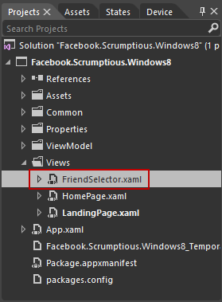

- Click on the Assets tab and search for _ListBox_. Taking care to make sure that the First Grid, which houses the entire page is selected in the _Objects and Timeline_ window, double click the _ListBox_. This will add the ListBox as the direct child of the top level _Grid_ panel.

- The above step will add the ListBox right on top of the back button. The Outer grid has two rows, one that houses the back button and page title and the second where the content should go. Unfortunately, at this point, the ListBox is in Row 0. See below:

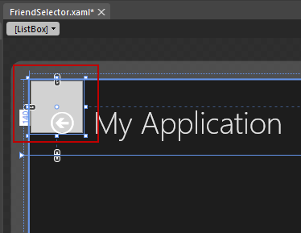

- Select the ListBox by clicking on it and then in the _Properties_ panel on the right side, set its _Row_ property to 1 - since row and column numbering starts from 0. This will bring the ListBox in the row meant for content. Additionally, we want the ListBox to occupy the entire width of screen but only as much vertical space is required. This can easily be done by Setting its Height and With property to Auto by clicking on the icons on the right side of Height and Width in the properties panel. Additionally, set the HorizontalAlignment and VerticalAlignment to scale. See the image below for illustration.

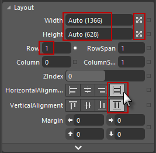

#### Setup the Data Binding of the ListBox
- Click on the outermost Grid in the _Objects and Timeline_ window. Once this is done, in the _Properties_ window,  locate the _DataContext_ property. Click the _New_ button located next to it. This will pop up a Window titled _Select Object_. Expand the _Facebook.Scrumptious.Windows8.ViewModel_ and select the _FacebookData_ node. This makes the entire _FacebookData_ class available to this page as a resource. Any UI element can now bind to variables in the _DataContext_.

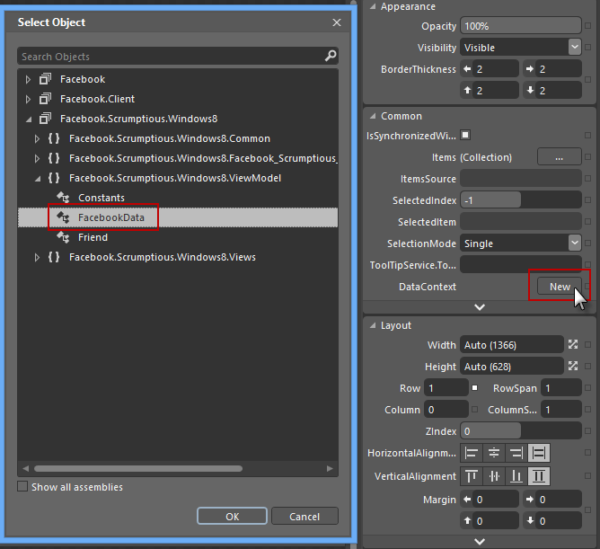

- Now, we will bind the ListBox to the _ObservableCollection_ of _Friends_ in the _FacebookData_ class that is available to us via the _DataContext_ we just created above. To do this, select the listbox in the _Objects and Timeline_ window and click on the little square next to the _ItemsSource_ property. This will pop up a Context Menu, select _Create Data Binding_ from it. This will open a window called "Create Data Binding for [ListBox].ItemsSource. Select the _Friends_ collection from this window and hit OK. This will set the Friends ObservableCollection to the Source of Data for this ListBox.

Click on square next to Items Source

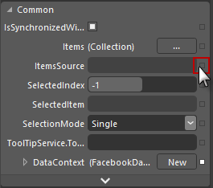

Bind to _ObservableCollection<Friends>_

- At this point, the ListBox is bound to the ObservableCollection, but individual properties in the Friend Objects are not bound to individual ListBoxItems in the ListBox. To do this, right click on the ListBox in the _Objects and Timeline_ window, select _Edit Additional Templates -> Edit Generated Items (ItemTemplate) -> Create Empty_ and hit OK on resulting dialog box.

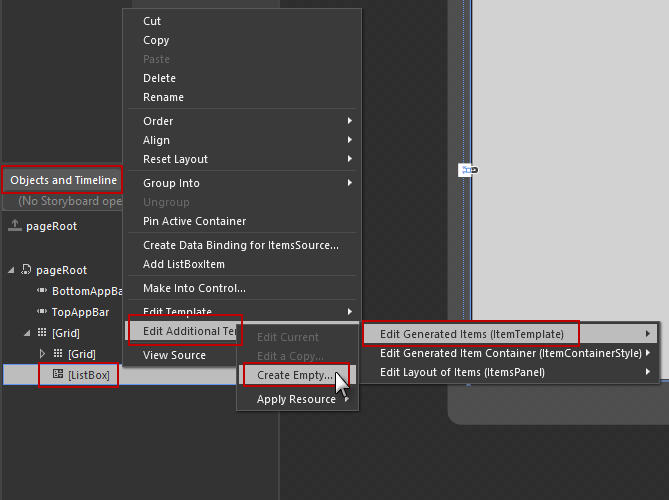

This will create the layout of a single ListBoxItem. For each Friend, we are going to retrieve an Image and name, so lets search of Image and TextBlock items in the Assets Window and add them here under the _Grid_ element.

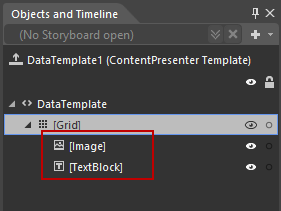

Similar to how you bound the ItemsSource of the ListBox, you can now bind the Source for the Image and the Text for the TextBlock using Blend as well. See the illustrations below.

Bind the image source to the Friend object's PictureUri property.

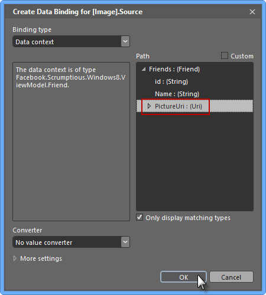

Bind the TextBlock's Text to the Friend object's Name property.

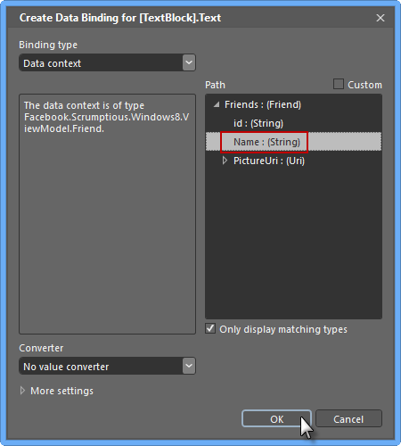

Also, set the Grid's height and width to Auto and the Image's Height and Width property to 50px each.

Save your work and run the program. If you have followed through all the steps, you will see the following screen:

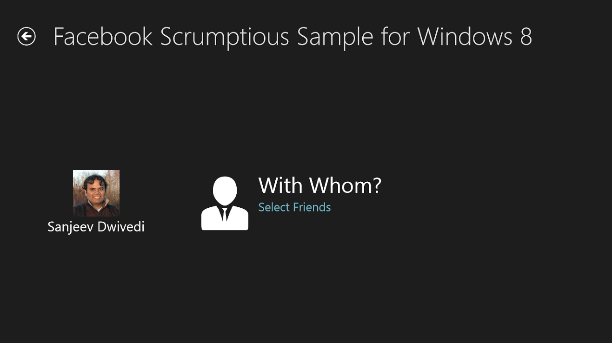

If you click on the _Select Friends_ text, it will take you to a list of friends, that looks like the following:

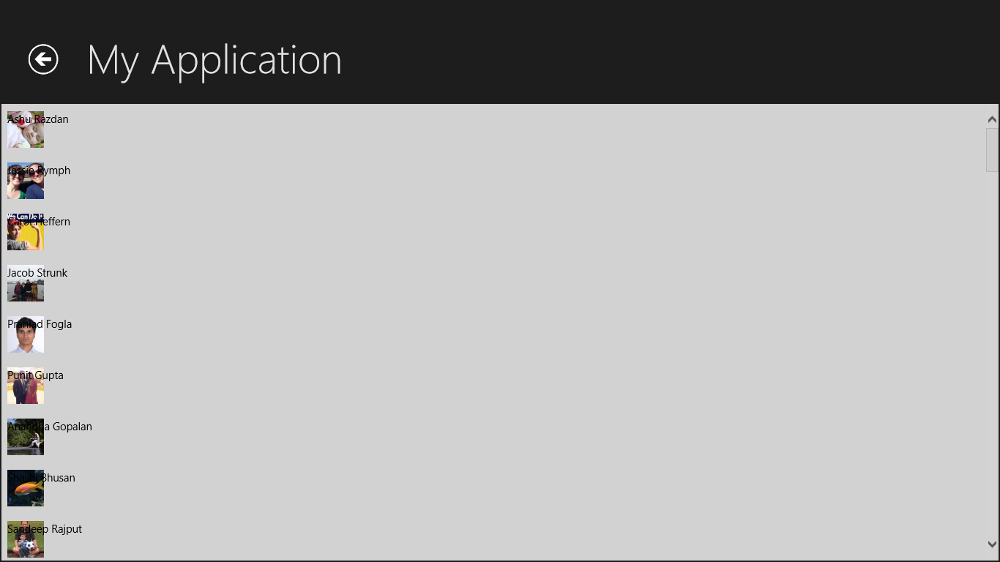

As you can see, using Blend, within a few easy steps, we are able to create a ListBox and bind the friend data to it without writing a single line of code. The UI looks a bit garbled and we can pick only one friend at a time, but this illustrates the power of using Expression Blend. I will leave it as an exercise to you on how to follow along Blend and style the ListBox and how to allow Multiple Select. In interest of of making progress, at this point of time, just overwrite all the contents of the FriendSelector.xaml with the following pre-built and styled ListBox code:

    <common:LayoutAwarePage
    xmlns="http://schemas.microsoft.com/winfx/2006/xaml/presentation"
    xmlns:x="http://schemas.microsoft.com/winfx/2006/xaml"
    xmlns:local="using:Facebook.Scrumptious.Windows8.Views"
    xmlns:common="using:Facebook.Scrumptious.Windows8.Common"
    xmlns:d="http://schemas.microsoft.com/expression/blend/2008"
    xmlns:mc="http://schemas.openxmlformats.org/markup-compatibility/2006"
    xmlns:ViewModel="using:Facebook.Scrumptious.Windows8.ViewModel"
    x:Name="pageRoot"
    x:Class="Facebook.Scrumptious.Windows8.Views.FriendSelector"
    DataContext="{Binding DefaultViewModel, RelativeSource={RelativeSource Mode=Self}}"
    mc:Ignorable="d">

    <common:LayoutAwarePage.Resources>

        <!-- TODO: Delete this line if the key AppName is declared in App.xaml -->
        <x:String x:Key="AppName">Select Friends</x:String>
        <DataTemplate x:Key="FriendsListBoxItemTemplate">
            <Grid>
                <Grid.ColumnDefinitions>
                    <ColumnDefinition Width="50"/>
                    <ColumnDefinition Width="
					*"/>
                </Grid.ColumnDefinitions>
                <Image Height="50" Width="50" Grid.Column="0" Stretch="None" Source="{Binding PictureUri}"/>
                <TextBlock x:Name="friendName" HorizontalAlignment="Left" TextWrapping="Wrap" Text="{Binding Name}" VerticalAlignment="Top" FontFamily="Segoe UI" FontSize="26.667" Grid.ColumnSpan="2" Grid.Column="1"/>
            </Grid>
        </DataTemplate>
    </common:LayoutAwarePage.Resources>

    <!--
        This grid acts as a root panel for the page that defines two rows:
        * Row 0 contains the back button and page title
        * Row 1 contains the rest of the page layout
    -->
    <Grid Style="{StaticResource LayoutRootStyle}">
        <Grid.RowDefinitions>
            <RowDefinition Height="140"/>
            <RowDefinition Height="*"/>
        </Grid.RowDefinitions>

        <VisualStateManager.VisualStateGroups>

            <!-- Visual states reflect the application's view state -->
            <VisualStateGroup x:Name="ApplicationViewStates">
                <VisualState x:Name="FullScreenLandscape"/>
                <VisualState x:Name="Filled"/>

                <!-- The entire page respects the narrower 100-pixel margin convention for portrait -->
                <VisualState x:Name="FullScreenPortrait">
                    <Storyboard>
                        <ObjectAnimationUsingKeyFrames Storyboard.TargetName="backButton" Storyboard.TargetProperty="Style">
                            <DiscreteObjectKeyFrame KeyTime="0" Value="{StaticResource PortraitBackButtonStyle}"/>
                        </ObjectAnimationUsingKeyFrames>
                    </Storyboard>
                </VisualState>

                <!-- The back button and title have different styles when snapped -->
                <VisualState x:Name="Snapped">
                    <Storyboard>
                        <ObjectAnimationUsingKeyFrames Storyboard.TargetName="backButton" Storyboard.TargetProperty="Style">
                            <DiscreteObjectKeyFrame KeyTime="0" Value="{StaticResource SnappedBackButtonStyle}"/>
                        </ObjectAnimationUsingKeyFrames>
                        <ObjectAnimationUsingKeyFrames Storyboard.TargetName="pageTitle" Storyboard.TargetProperty="Style">
                            <DiscreteObjectKeyFrame KeyTime="0" Value="{StaticResource SnappedPageHeaderTextStyle}"/>
                        </ObjectAnimationUsingKeyFrames>
                    </Storyboard>
                </VisualState>
            </VisualStateGroup>
        </VisualStateManager.VisualStateGroups>
        <Grid.DataContext>
            <ViewModel:FacebookData/>
        </Grid.DataContext>
        <Grid Grid.Row="0">
            <Grid.ColumnDefinitions>
                <ColumnDefinition Width="Auto"/>
                <ColumnDefinition Width="*"/>
            </Grid.ColumnDefinitions>
            <Button x:Name="backButton" Click="GoBack" IsEnabled="{Binding Frame.CanGoBack, ElementName=pageRoot}" Style="{StaticResource BackButtonStyle}"/>
            <TextBlock x:Name="pageTitle" Grid.Column="1" Text="{StaticResource AppName}" Style="{StaticResource PageHeaderTextStyle}"/>
        </Grid>
        <ListBox x:Name="friendsListBox" Grid.Row="1" ItemsSource="{Binding Friends}" ItemTemplate="{StaticResource FriendsListBoxItemTemplate}" SelectionMode="Multiple"/>

    </Grid>
    </common:LayoutAwarePage>

Running the app after this will lead to a ListBox that looks like the following and also allows MultiSelect.

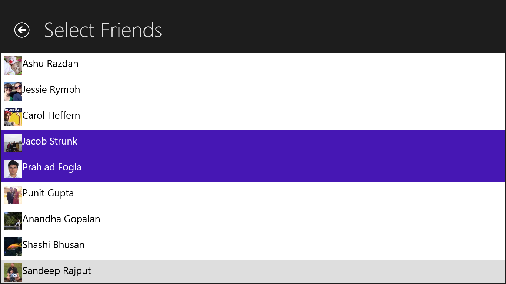

Now add the following code to the FacebookData class in FacebooDataModel.cs to store the list of selected friends in the FriendSelector page.

        private static ObservableCollection<Friend> selectedFriends = new ObservableCollection<Friend>();
        public static ObservableCollection<Friend> SelectedFriends
        {
            get
            {
                return selectedFriends;
            }
        }

Add the following code to FriendSelector.xaml.cs to allow the selected list of friends to be stored in the _FacebookData.SelectedFriends_ variable, when we navigate away from the FriendSelector page:

        protected override void OnNavigatedFrom(NavigationEventArgs e)
        {
            // this runs in the UI thread, so it is ok to modify the 
            // viewmodel directly here
            FacebookData.SelectedFriends.Clear();
            var selectedFriends = this.friendsListBox.SelectedItems;
            foreach (Friend oneFriend in selectedFriends)
            {
                FacebookData.SelectedFriends.Add(oneFriend);
            }

            base.OnNavigatedFrom(e);
        }

And finally, in LandingPage.xaml.cs, add the following code to update the LandingPage with the friends who have been selected:

        protected override void OnNavigatedTo(NavigationEventArgs e)
        {
            base.OnNavigatedTo(e);
            if (FacebookData.SelectedFriends.Count > 0)
            {
                if (FacebookData.SelectedFriends.Count > 1)
                {
                    this.selectFriendsTextBox.Text = String.Format("with {0} and {1} others", FacebookData.SelectedFriends[0].Name, FacebookData.SelectedFriends.Count - 1);
                }
                else
                {
                    this.selectFriendsTextBox.Text = "with " + FacebookData.SelectedFriends[0].Name;
                }
            }
            else
            {
                this.selectFriendsTextBox.Text = "Select Friends";
            }
        }
        
Build the code at this point of time and make sure you resolve all symbols as shown earlier in the tutorial. This time around when you select friends on the FriendSelector Page and navigate back to the LandingPage, you should see the list of selected friends on the LandingPage.
        
##Show Nearby Places

Next, we will see how to query Facebook for Nearby places to eat.

### Setup the DataModel classes
Add the following code to FacebookDataModel.cs as a class in the namespace directly to hold the details of a single restaurant:

    public class Location
    {
        public string Street { get; set; }
        public string City { get; set; }
        public string State { get; set; }
        public string Country { get; set; }
        public string Zip { get; set; }
        public string Latitude { get; set; }
        public string Longitude { get; set; }

        public string Category { get; set; }
        public string Name { get; set; }
        public string Id { get; set; }
        public Uri PictureUri { get; set; }
    }

Add the following code to FacebookDataModel.cs in FacebookData class which sets up the Locations object as well as a variable to hold the SelectedRestaurant when the user selects a restaurant

        private static ObservableCollection<Location> locations = new ObservableCollection<Location>();
        public static ObservableCollection<Location> Locations
        {
            get
            {
                return locations;
            }
        }

        private static bool isRestaurantSelected = false;
        public static bool IsRestaurantSelected
        {
            get
            {
                return isRestaurantSelected;
            }
            set
            {
                isRestaurantSelected = value;
            }
        }

        public static Location SelectedRestaurant { get; set; }

###Setup the UI

Let's first add UI elements to the LandingPage for the user to be able to select a place to eat. Copy the following code to the LandingPage.xaml just above the grid named _WithWhomGrid_:

                <Grid x:Name="WhereAreYouEatingGrid" >
        			<Grid.ColumnDefinitions>
        				<ColumnDefinition Width="150"/>
        				<ColumnDefinition Width="*"/>
        			</Grid.ColumnDefinitions>
        			<Image HorizontalAlignment="Center" Height="150" VerticalAlignment="Center" Width="150"  Grid.Column="0" Stretch="None" Source="ms-appx:///Assets/PlacesWin8.png" />
        			<StackPanel Grid.Column="1">
        				<TextBlock TextWrapping="Wrap" Text="Where are you?" FontFamily="Segoe UI" FontSize="48"/>
        				<TextBlock x:Name="selectRestaurantTextBox" TextWrapping="Wrap" Text="Select One" FontFamily="Segoe UI" FontSize="26.667" Foreground="#FF6DB7C7" Tapped="selectRestaurantTextBox_Tapped"/>
        			</StackPanel>
        		</Grid>

Also, add the event handler for the tap event handler for the place selector in LandingPage.xaml.cs which will take us to the Restaurant selector page, which we will add shortly.

        async private void selectRestaurantTextBox_Tapped(object sender, TappedRoutedEventArgs e)
        {
            Geolocator _geolocator = new Geolocator();
            CancellationTokenSource _cts = new CancellationTokenSource();
            CancellationToken token = _cts.Token;

            // Carry out the operation
            Geoposition pos = null;

            // default location is somewhere in redmond, WA
            double latitude = 47.627903;
            double longitude =  -122.143185;
            try
            {
                // We will wait 100 milliseconds and accept locations up to 48 hours old before we give up
                pos = await _geolocator.GetGeopositionAsync(new TimeSpan(48,0,0), new TimeSpan(0,0,0,0,100)).AsTask(token);
            }
            catch (Exception )
            {
                // this API can timeout, so no point breaking the code flow. Use
                // default latitutde and longitude and continue on.
            }

            if (pos != null)
            {
                latitude = pos.Coordinate.Latitude;
                longitude = pos.Coordinate.Longitude;
            }

            FacebookClient fb = new FacebookClient(App.AccessToken);
            dynamic restaurantsTaskResult = await fb.GetTaskAsync("/search", new { q = "restaurant", type = "place", center = latitude.ToString() + "," + longitude.ToString(), distance = "1000" });

            var result = (IDictionary<string, object>)restaurantsTaskResult;

            var data = (IEnumerable<object>)result["data"];

            foreach (var item in data)
            {
                var restaurant = (IDictionary<string, object>)item;

                var location = (IDictionary<string, object>)restaurant["location"];
                FacebookData.Locations.Add(new Location
                {
                    // the address is one level deeper within the object
                    Street = location.ContainsKey("street") ? (string)location["street"] : String.Empty,
                    City = location.ContainsKey("city") ? (string)location["city"] : String.Empty,
                    State = location.ContainsKey("state") ? (string)location["state"] : String.Empty,
                    Country = location.ContainsKey("country") ? (string)location["country"] : String.Empty,
                    Zip = location.ContainsKey("zip") ? (string)location["zip"] : String.Empty,
                    Latitude = location.ContainsKey("latitude") ? ((double)location["latitude"]).ToString() : String.Empty,
                    Longitude = location.ContainsKey("longitude") ? ((double)location["longitude"]).ToString() : String.Empty,

                    // these properties are at the top level in the object
                    Category = restaurant.ContainsKey("category") ? (string)restaurant["category"] : String.Empty,
                    Name = restaurant.ContainsKey("name") ? (string)restaurant["name"] : String.Empty,
                    Id = restaurant.ContainsKey("id") ? (string)restaurant["id"] : String.Empty,
                    PictureUri = new Uri(string.Format("https://graph.facebook.com/{0}/picture?type={1}&access_token={2}", (string)restaurant["id"], "square", App.AccessToken))
                });
            }

            Frame.Navigate(typeof(Restaurants));
        }

The above code tries to connect to the Location Services in the device to try and get your location. If it fails, it falls back to a known Location in Redmond, WA as the center of the search. To make sure that your application has access to the Location Services, you have to declare Location Capability in the application manifest.
                
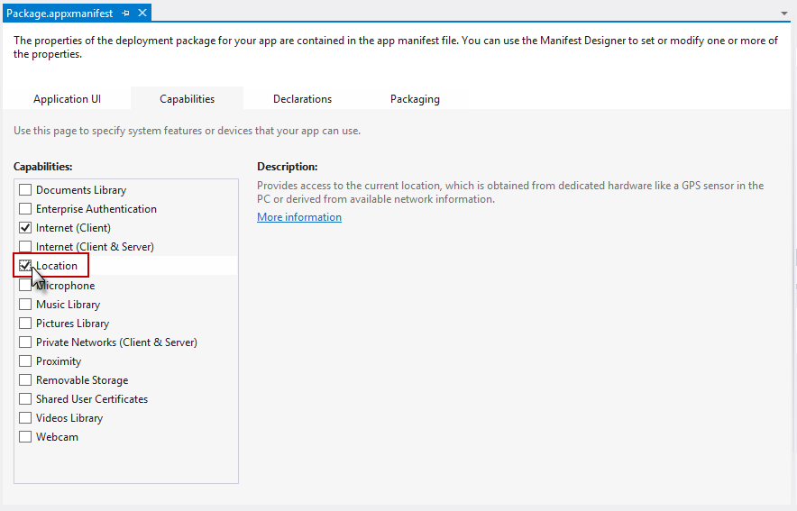

The rest of the code above connects to the Graph API URL _/search_ and supplies appropriate parameters to it to perform a location search within 1 Mile. Once this data has been retrieved, _FacebookData.Locations_ static variable gets populated with the result.
                
Now, in the Views folder, add another Basic Page and name it Restaurants.xaml. As we did earlier with the FriendSelector page, we will setup DataBinding between a ListBox that we put on the Restaurants Page and the _Locations_ variable in the FacebookData class. For sake of brevity, copy the following code into Restaurants.xaml:

    <common:LayoutAwarePage
    xmlns="http://schemas.microsoft.com/winfx/2006/xaml/presentation"
    xmlns:x="http://schemas.microsoft.com/winfx/2006/xaml"
    xmlns:local="using:Facebook.Scrumptious.Windows8.Views"
    xmlns:common="using:Facebook.Scrumptious.Windows8.Common"
    xmlns:d="http://schemas.microsoft.com/expression/blend/2008"
    xmlns:mc="http://schemas.openxmlformats.org/markup-compatibility/2006"
    xmlns:ViewModel="using:Facebook.Scrumptious.Windows8.ViewModel"
    x:Name="pageRoot"
    x:Class="Facebook.Scrumptious.Windows8.Views.Restaurants"
    DataContext="{Binding DefaultViewModel, RelativeSource={RelativeSource Mode=Self}}"
    mc:Ignorable="d">

    <common:LayoutAwarePage.Resources>

        <!-- TODO: Delete this line if the key AppName is declared in App.xaml -->
        <x:String x:Key="AppName">Pick a place</x:String>
        <DataTemplate x:Key="RestaurantListBoxItemTemplate">
        	<Grid>
        		<Grid.ColumnDefinitions>
        			<ColumnDefinition Width="11*"/>
        			<ColumnDefinition Width="12*"/>
        		</Grid.ColumnDefinitions>
        		<Image HorizontalAlignment="Center" Height="50" VerticalAlignment="Center" Width="50" Source="{Binding PictureUri}"/>
        		<StackPanel Grid.Column="1" Margin="0,0,0,18" Orientation="Vertical">
        			<TextBlock x:Name="RestaurantName" HorizontalAlignment="Left" TextWrapping="Wrap" Text="{Binding Name}" VerticalAlignment="Top" FontSize="26.667" FontFamily="Segoe UI"/>
        			<TextBlock x:Name="PlaceType" TextWrapping="Wrap" Text="{Binding Category}" FontFamily="Segoe  ui" FontSize="14.667"/>
        		</StackPanel>
        	</Grid>
        </DataTemplate>
       </common:LayoutAwarePage.Resources>

    <!--
        This grid acts as a root panel for the page that defines two rows:
        * Row 0 contains the back button and page title
        * Row 1 contains the rest of the page layout
    -->
    <Grid Style="{StaticResource LayoutRootStyle}">
        <Grid.RowDefinitions>
            <RowDefinition Height="140"/>
            <RowDefinition Height="*"/>
        </Grid.RowDefinitions>

        <VisualStateManager.VisualStateGroups>

            <!-- Visual states reflect the application's view state -->
            <VisualStateGroup x:Name="ApplicationViewStates">
                <VisualState x:Name="FullScreenLandscape"/>
                <VisualState x:Name="Filled"/>

                <!-- The entire page respects the narrower 100-pixel margin convention for portrait -->
                <VisualState x:Name="FullScreenPortrait">
                    <Storyboard>
                        <ObjectAnimationUsingKeyFrames Storyboard.TargetName="backButton" Storyboard.TargetProperty="Style">
                            <DiscreteObjectKeyFrame KeyTime="0" Value="{StaticResource PortraitBackButtonStyle}"/>
                        </ObjectAnimationUsingKeyFrames>
                    </Storyboard>
                </VisualState>

                <!-- The back button and title have different styles when snapped -->
                <VisualState x:Name="Snapped">
                    <Storyboard>
                        <ObjectAnimationUsingKeyFrames Storyboard.TargetName="backButton" Storyboard.TargetProperty="Style">
                            <DiscreteObjectKeyFrame KeyTime="0" Value="{StaticResource SnappedBackButtonStyle}"/>
                        </ObjectAnimationUsingKeyFrames>
                        <ObjectAnimationUsingKeyFrames Storyboard.TargetName="pageTitle" Storyboard.TargetProperty="Style">
                            <DiscreteObjectKeyFrame KeyTime="0" Value="{StaticResource SnappedPageHeaderTextStyle}"/>
                        </ObjectAnimationUsingKeyFrames>
                    </Storyboard>
                </VisualState>
            </VisualStateGroup>
        </VisualStateManager.VisualStateGroups>
    	<Grid.DataContext>
    		<ViewModel:FacebookData/>
    	</Grid.DataContext>

        <!-- Back button and page title -->
        <Grid>
        	<Grid.RowDefinitions>
        		<RowDefinition Height="139*"/>
        		<RowDefinition/>
        	</Grid.RowDefinitions>
            <Grid.ColumnDefinitions>
                <ColumnDefinition Width="Auto"/>
                <ColumnDefinition Width="*"/>
            </Grid.ColumnDefinitions>
            <Button x:Name="backButton" Click="GoBack" IsEnabled="{Binding Frame.CanGoBack, ElementName=pageRoot}" Style="{StaticResource BackButtonStyle}" Margin="36,0,0,35.274"/>
            <TextBlock x:Name="pageTitle" Grid.Column="1" Text="{StaticResource AppName}" Style="{StaticResource PageHeaderTextStyle}" Margin="0,0,30,39.274"/>
        </Grid>
        <Grid Grid.Row="1">
        	<ListBox x:Name="restaurantsListBox" VerticalAlignment="Top" ItemsSource="{Binding Locations}" ItemTemplate="{StaticResource RestaurantListBoxItemTemplate}"/>
        </Grid>

    </Grid>
    </common:LayoutAwarePage>

Finally, we need two more event handlers:

- In Restaurants.xaml.cs, add the following code to note the selected Restaurant in the ViewModel:

        protected override void OnNavigatedFrom(NavigationEventArgs e)
        {
            if (this.restaurantsListBox.SelectedIndex >= 0)
            {
                FacebookData.SelectedRestaurant = (Location)this.restaurantsListBox.SelectedItem;
                FacebookData.IsRestaurantSelected = true;
            }

            base.OnNavigatedFrom(e);
        }

- In LandingPage.xaml.cs, add the following code to the OnNavigatedTo event to display the selected Restaurant:

            if (FacebookData.IsRestaurantSelected)
            {
                this.selectRestaurantTextBox.Text = FacebookData.SelectedRestaurant.Name;
            }

At this step, if you have followed all the steps correctly and resolved all references, you should see the UI flow like the following:

Ask Permisson for Location Capability

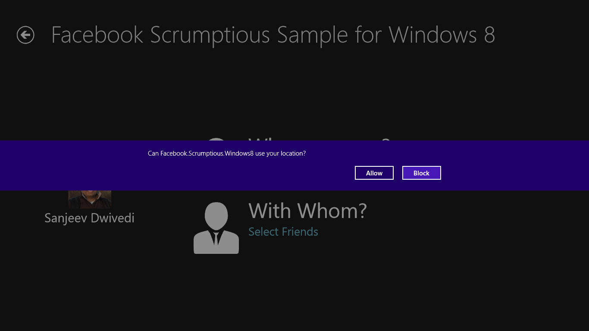

Select a Restaurant

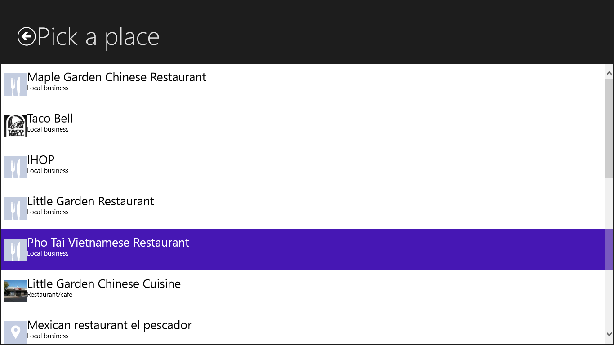

Final Landing Page UI

## Publish Open Graph Story

In this tutorial, you'll bring everything together and publish an Open Graph story. The previous steps let the user specify where they are and who they're with. Now, we'll implement a flow that lets the user select a meal and share what they're doing on their timeline.

You should follow the following three 

### Configure Open Graph in the App Dashboard

In this step, you'll define the Open Graph action, object and aggregation in the App Dashboard. Define an _eat_ action with a corresponding _meal_ object. You can define a simple aggregation on the _eat_ action that displays a list of recent meals on the user's timeline. See the [Open Graph Tutorial](https://developers.facebook.com/docs/opengraph/tutorial/#define) to set up your action, object and aggregation.

When you're done with the flow, your Open Graph dashboard should look like this:

One thing to make sure is that you should edit your _Eat_ action to have these two capabilities, otherwise you will keep hitting exceptions about your app not having these capabilities:

### Set Up Your Backend Server

Open Graph objects need to exist as webpages on a server that Facebook can access. These pages use Open Graph tags that Facebook servers scrape to properly identify the data and connect it to the user. For example, you could have a ''pizza'' webpage that represents a ''pizza'' instance of a meal. When the user publishes a story with your app, this connects an ''eat'' action to the ''pizza'' object.

In this tutorial, you'll set up static pages to represent each meal (ex: pizza or hotdog). Let's start by creating a webpage that represents a pizza object. You can start with a very simple webpage and add the appropriate Open Graph markup. Here's the initial HTML:

    <html>
    <head>
    <!-- ADD SAMPLE OBJECT MARKUP CODE HERE -->   
    </head>
    <body>
        <h1>Sample Meal</h1>
    </body>
    </html>

You can get sample object markup code from the App Dashboard > Open Graph > Dashboard tab. Click the Get Code link next to the Meal object to show the sample markup:

Copying the sample code into your HTML should result in code similar to this:

    <html>
    <head prefix="og: http://ogp.me/ns# fb: http://ogp.me/ns/fb# scrumptiousmsft: http://ogp.me/ns/fb/scrumptiousmsft#">
        <meta property="fb:app_id" content="540541885996234" /> 
        <meta property="og:type"   content="scrumptiousmsft:meal" /> 
        <meta property="og:url"    content="Put your own URL to the object here" /> 
        <meta property="og:title"  content="Sample Meal" /> 
        <meta property="og:image"  content="https://fbstatic-a.akamaihd.net/images/devsite/attachment_blank.png" /> 
    </head>
    <body>
        <h1>Sample Meal</h1>
    </body>
    </html>
    
The prefix, fb:app_id and og:type will be different for your code as this corresponds to your Facebook App ID and your Facebook app's namespace.

Replace the following values in the HTML code:

- Put your own URL to the object here: replace this with the URL that's you'll use to host your pizza object (ex: https://fbsdkog.herokuapp.com/pizza.html)
- Sample Meal: replace this with a title for the object (ex: Pizza)
- og:image: replace this with a JPEG or PNG image URL that represents your object

Save the HTML as _pizza.html_ and upload the file to your backend server. Remember you specified the backend server when you provisioned your Facebook App on the Facebook Dev Portal.

Once you've uploaded the HTML page, test the sample object using the [Object Debugger](https://developers.facebook.com/tools/debug). Enter the pizza object URL into the debugger and submit the URL. Fix any errors you find before moving on.

Now that you've set up a pizza object as a webpage, repeat this process for meal objects representing the following: Cheeseburger, Hotdog, Italian, French, Chinese, Thai and Indian.

###Publish a Test Action
Now that you've configured your Open Graph information and set up your objects, try publishing an action outside of your Android app with the Graph API Explorer. Go to the Graph API Explorer and select your app from the ''Application'' list. Then, change the action type from the default ''GET'' to ''POST''. Enter me/<YOUR_APP_NAMESPACE>:eat in the Graph API endpoint field and add the following POST data:

- meal = <OBJECT_URL>
- tags = <FRIEND_USER_ID>
- place = <PLACE_ID> e.g. 111615355559307

Once you enter the additional fields, your form should look like this:

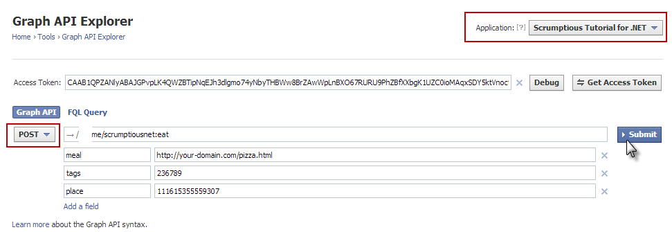

Submit your test action. You should see a response similar to this:

    {
        "id": "4907118722194"
    }

Now, login to Facebook and go to your Activity Log to verify the story posted correctly. You may hit the following error:

    {
        "error": {
            "type": "Exception", 
            "message": "These users can't be tagged by your app: 100002768941660. Either they aren't developers of your app or your action haven't been approved for tagging.", 
            "code": 1611075
        }
    }

The reason for this is that the user you're trying to tag is not an admin, developer or tester for your app. Go the Roles section for your app in the App Dashboard and add the user you want to tag to the appropriate role. You'll have to wait for that user to accept the request for you to add them to your app.

If you ever have issues using Graph API queries in your Windows app test the same queries out using the [Graph API Explorer](https://developers.facebook.com/tools/explorer) tool.
    
### Add the Meal Selection Flow

Add the following Meal object in the ViewModel:

    public class Meal
    {
        public string Name { get; set; }
        public string MealUri { get; set; }
    }

Additionally, add the following ObservableCollection of Meal objects for DataBinding to the MealSelector Page:

    private static bool isLoadedMeals = false;
        private static ObservableCollection<Meal> meals = new ObservableCollection<Meal>();
        public static ObservableCollection<Meal> Meals
        {
            get
            {
                if (!isLoadedMeals)
                {
                    
                    meals.Add(new Meal { Name = "Pizza", MealUri = Constants.FBActionBaseUri + "pizza.html" });
                    meals.Add(new Meal { Name = "Cheeseburger", MealUri = Constants.FBActionBaseUri + "cheeseburger.html" });
                    meals.Add(new Meal { Name = "Hotdog", MealUri = Constants.FBActionBaseUri + "hotdog.html" });
                    meals.Add(new Meal { Name = "Italian", MealUri = Constants.FBActionBaseUri + "italian.html" });
                    meals.Add(new Meal { Name = "French", MealUri = Constants.FBActionBaseUri + "french.html" });
                    meals.Add(new Meal { Name = "Chinese", MealUri = Constants.FBActionBaseUri + "chinese.html" });
                    meals.Add(new Meal { Name = "Thai", MealUri = Constants.FBActionBaseUri + "thai.html" });
                    meals.Add(new Meal { Name = "Indian", MealUri = Constants.FBActionBaseUri + "indian.html" });
                    isLoadedMeals = true;
                }

                return meals;
            }
        }

        private static Meal selectedMeal = new Meal { Name = String.Empty, MealUri = String.Empty };
        public static Meal SelectedMeal
        {
            get
            {
                return selectedMeal;
            }

            set
            {
                selectedMeal = value;
            }
        }

Additionally, copy the following code to the Constants.cs class:

        public static readonly string FBActionBaseUri = "Base URL for the website where your meal pages exist";
        public static readonly string FacebookAppId = "<Your App ID>";
        public static readonly string FacebookAppGraphAction = "<Your namespace>";

Now create a Basic Page in the Views Folder called MealSelector that will host the Meal Selection ListBox and replace the contents of the MealSelector.xaml with the following XAML code inside it:

    <common:LayoutAwarePage
    xmlns="http://schemas.microsoft.com/winfx/2006/xaml/presentation"
    xmlns:x="http://schemas.microsoft.com/winfx/2006/xaml"
    xmlns:local="using:Facebook.Scrumptious.Windows8.Views"
    xmlns:common="using:Facebook.Scrumptious.Windows8.Common"
    xmlns:d="http://schemas.microsoft.com/expression/blend/2008"
    xmlns:mc="http://schemas.openxmlformats.org/markup-compatibility/2006"
    xmlns:ViewModel="using:Facebook.Scrumptious.Windows8.ViewModel"
    x:Name="pageRoot"
    x:Class="Facebook.Scrumptious.Windows8.Views.MealSelector"
    DataContext="{Binding DefaultViewModel, RelativeSource={RelativeSource Mode=Self}}"
    mc:Ignorable="d">

    <common:LayoutAwarePage.Resources>

        <!-- TODO: Delete this line if the key AppName is declared in App.xaml -->
        <x:String x:Key="AppName">My Application</x:String>
        <DataTemplate x:Key="MealsItemTemplate">
        	<Grid>
        		<TextBlock HorizontalAlignment="Left" TextWrapping="Wrap" Text="{Binding Name}" VerticalAlignment="Top" FontSize="26.667"/>
        	</Grid>
        </DataTemplate>
    </common:LayoutAwarePage.Resources>

    <!--
        This grid acts as a root panel for the page that defines two rows:
        * Row 0 contains the back button and page title
        * Row 1 contains the rest of the page layout
    -->
    <Grid Style="{StaticResource LayoutRootStyle}">
        <Grid.RowDefinitions>
            <RowDefinition Height="140"/>
            <RowDefinition Height="*"/>
        </Grid.RowDefinitions>

        <VisualStateManager.VisualStateGroups>

            <!-- Visual states reflect the application's view state -->
            <VisualStateGroup x:Name="ApplicationViewStates">
                <VisualState x:Name="FullScreenLandscape"/>
                <VisualState x:Name="Filled"/>

                <!-- The entire page respects the narrower 100-pixel margin convention for portrait -->
                <VisualState x:Name="FullScreenPortrait">
                    <Storyboard>
                        <ObjectAnimationUsingKeyFrames Storyboard.TargetName="backButton" Storyboard.TargetProperty="Style">
                            <DiscreteObjectKeyFrame KeyTime="0" Value="{StaticResource PortraitBackButtonStyle}"/>
                        </ObjectAnimationUsingKeyFrames>
                    </Storyboard>
                </VisualState>

                <!-- The back button and title have different styles when snapped -->
                <VisualState x:Name="Snapped">
                    <Storyboard>
                        <ObjectAnimationUsingKeyFrames Storyboard.TargetName="backButton" Storyboard.TargetProperty="Style">
                            <DiscreteObjectKeyFrame KeyTime="0" Value="{StaticResource SnappedBackButtonStyle}"/>
                        </ObjectAnimationUsingKeyFrames>
                        <ObjectAnimationUsingKeyFrames Storyboard.TargetName="pageTitle" Storyboard.TargetProperty="Style">
                            <DiscreteObjectKeyFrame KeyTime="0" Value="{StaticResource SnappedPageHeaderTextStyle}"/>
                        </ObjectAnimationUsingKeyFrames>
                    </Storyboard>
                </VisualState>
            </VisualStateGroup>
        </VisualStateManager.VisualStateGroups>
    	<Grid.DataContext>
    		<ViewModel:FacebookData/>
    	</Grid.DataContext>

        <!-- Back button and page title -->
        <Grid>
            <Grid.ColumnDefinitions>
                <ColumnDefinition Width="Auto"/>
                <ColumnDefinition Width="*"/>
            </Grid.ColumnDefinitions>
            <Button x:Name="backButton" Click="GoBack" IsEnabled="{Binding Frame.CanGoBack, ElementName=pageRoot}" Style="{StaticResource BackButtonStyle}"/>
            <TextBlock x:Name="pageTitle" Grid.Column="1" Text="{StaticResource AppName}" Style="{StaticResource PageHeaderTextStyle}"/>
        </Grid>
        <ListBox x:Name="mealSelectionListBox" Grid.Row="1" VerticalAlignment="Top" ItemsSource="{Binding Meals}" ItemTemplate="{StaticResource MealsItemTemplate}" SelectionChanged="mealSelectionListBox_SelectionChanged"/>

    </Grid>
    </common:LayoutAwarePage>

Also, add the following event hanlder in MealSelector.xaml.cs to note down the selected meal to the ViewModel:

        private void mealSelectionListBox_SelectionChanged(object sender, SelectionChangedEventArgs e)
        {
            if (this.mealSelectionListBox.SelectedItem != null)
            {
                FacebookData.SelectedMeal = (Meal)this.mealSelectionListBox.SelectedItem;
            }
        }
        
Now, Add the following XAML to the LandingPage.xaml just above the Grid named _WhereAreYouEatingGrid_ to add the UI elements to allow navigating to the MealSelector Page:

        		<Grid x:Name="WhatAreYouEatingGrid" >
        			<Grid.ColumnDefinitions>
        				<ColumnDefinition Width="150"/>
        				<ColumnDefinition Width="*"/>
        			</Grid.ColumnDefinitions>
        			<Image HorizontalAlignment="Center" Height="150" VerticalAlignment="Center" Width="150" Grid.Column="0" Stretch="None" Source="ms-appx:///Assets/CafeWin8.png" />
        			<StackPanel Height="100" Grid.Column="1" >
        				<TextBlock TextWrapping="Wrap" Text="What are you eating?" FontFamily="Segoe UI" FontSize="48"/>
        				<TextBlock x:Name="selectMealTextBox" TextWrapping="Wrap" Text="Select One" FontFamily="Segoe UI" FontSize="26.667" Foreground="#FF6DB7C7" Tapped="selectMealTextBox_Tapped"/>
        			</StackPanel>
        		</Grid>
 
Also, add the following code to LandingPage.xaml to navigate to the MealSelector page:

        private void selectMealTextBox_Tapped(object sender, Windows.UI.Xaml.Input.TappedRoutedEventArgs e)
        {
            Frame.Navigate(typeof(MealSelector));
        }
        
And Finally add the following code to the OnNavigatedTo event hanlder in LandingPage.xaml.cs to pick up the selected Meal once the meal selection has happened and the user navigates back to the LandingPage:

            if (!String.IsNullOrEmpty(FacebookData.SelectedMeal.Name))
            {
                this.selectMealTextBox.Text = FacebookData.SelectedMeal.Name;
            }
            
If you  followed the tutorial correctly, you should, at this point be able to run the application and see the following additional UI:

Meal Selection Page

Finished Landing Page

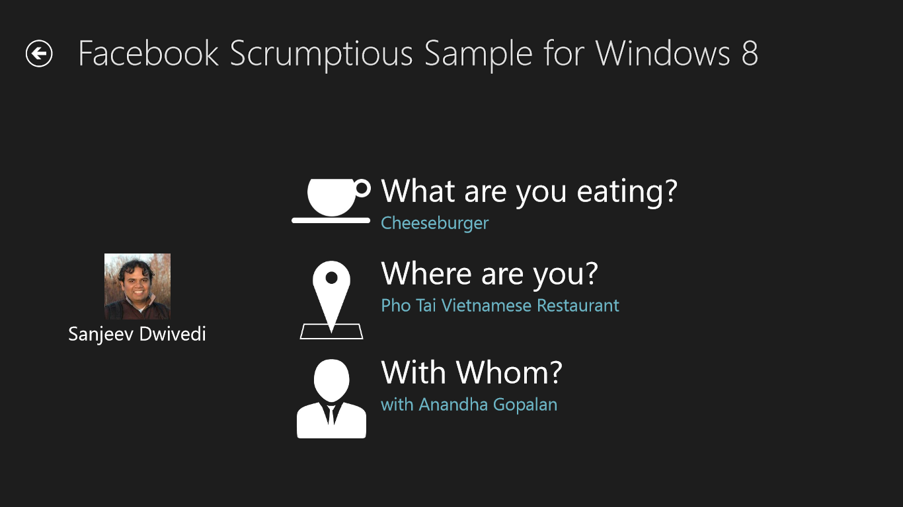

### Add the Publish Action Button

In this step, you'll finish setting up the UI by adding a submit button that publishes the Open Graph action through your app.

Add the following code to LandingPage.xaml directly as a descendent of _<common:LayoutAwarePage>_ node to add an Appbar button for posting the Open Graph Action to Facebook:

    <Page.BottomAppBar>
        <AppBar>
            <Grid>
                <Grid.ColumnDefinitions>
                    <ColumnDefinition/>
                    <ColumnDefinition/>
                </Grid.ColumnDefinitions>
                <StackPanel Orientation="Horizontal"/>
                <StackPanel Grid.Column="1" HorizontalAlignment="Right" Orientation="Horizontal">
                    <Button x:Name="PostButtonAppbar" Style="{StaticResource AppBarButtonStyle}" AutomationProperties.Name="Post" Content="&#x0E122;" Tapped="PostButtonAppbar_Tapped"/>
                </StackPanel>
            </Grid>
        </AppBar>
    </Page.BottomAppBar>

And Finally, add the following code to LandingPage.xaml.cs to post the Open Graph Action to Facebook and show a MessageDialog on success:

        async private void PostButtonAppbar_Tapped(object sender, TappedRoutedEventArgs e)
        {
            if (FacebookData.SelectedFriends.Count < 1
               || FacebookData.SelectedMeal.Name == String.Empty
               || FacebookData.IsRestaurantSelected == false)
            {
                MessageDialog errorMessageDialog = new MessageDialog("Please select friends, a place to eat and something you ate before attempting to share!");
                await errorMessageDialog.ShowAsync();
                return;
            }

            FacebookClient fb = new FacebookClient(App.AccessToken);

            try
            {
                dynamic fbPostTaskResult = await fb.PostTaskAsync(String.Format("/me/{0}:eat", Constants.FacebookAppGraphAction), new { meal = FacebookData.SelectedMeal.MealUri, tags = FacebookData.SelectedFriends[0].id, place = FacebookData.SelectedRestaurant.Id });
                var result = (IDictionary<string, object>)fbPostTaskResult;

                MessageDialog successMessageDialog = new MessageDialog("Posted Open Graph Action, id: " + (string)result["id"]);
                await successMessageDialog.ShowAsync();
            }
            catch (Exception ex)
            {
                MessageDialog exceptionMessageDialog = new MessageDialog("Exception during post: " + ex.Message);
                exceptionMessageDialog.ShowAsync();
            }
        }
        
The above code simply posts to _/me/scrumptiousmsft:eat_ url with the meal, friend's id and the location of the restaurant using the PostTaskAsync API.

>NOTE: Look at the Open Graph API for reference on how to fetch and post various kinds of data. Use the GetDataAsync or PostDataAsync to retrieve/send data to the URL depending on what operation the API supports. Passing the parameters is pretty easy by just creating a new object with properties set to the parameter names etc. There is No need to pre-create these objects.

If you followed the tutorial correctly, at this step  you should be able to run and publish the action to Facebook and see the following UI:

Post an action to Facebook:

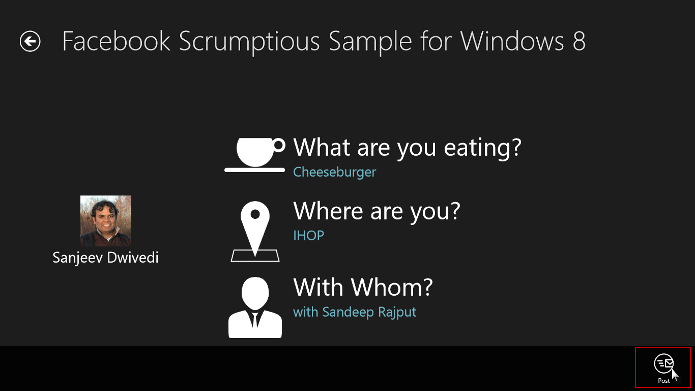

Response from Facebook:

Congratulations, you just finished the Windows 8 tutorial.